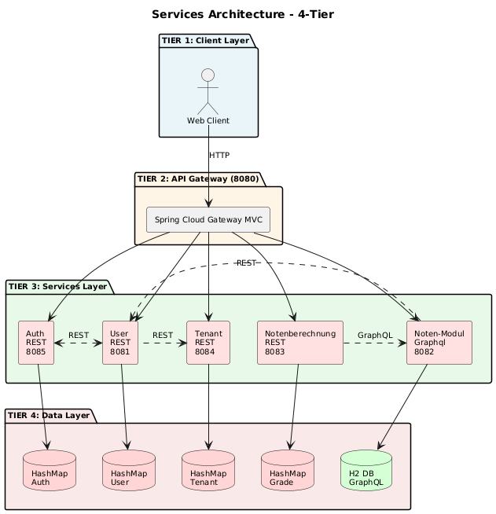

# Hochschul-Verwaltungssoftware


*Logo generiert durch künstliche Intelligenz (KI)*

Verteilte Hochschul-Verwaltungssoftware mit REST und GraphQL Services für mandantenfähige Verwaltung von Benutzern, Tenants, Authentifizierung und Notenberechnung.

## Architektur



*4-Tier Architektur mit API Gateway, Services und Data Layer. Vollständiger Source Code: [docs/architecture.puml](docs/architecture.puml)*

---

## Services

| Service | Port | Technologie | Beschreibung | Dokumentation |
|---------|------|-------------|--------------|---------------|
| **Gateway** | 8080 | REST | Routing, JWT-Validierung | - |
| **User-Service** | 8081 | REST | Benutzerverwaltung | [docs/USER_SERVICE_ARCHITECTURE.md](docs/USER_SERVICE_ARCHITECTURE.md) |
| **Auth-Service** | 8085 | REST | Authentifizierung, Credentials | [docs/AUTH_SERVICE_ARCHITECTURE.md](docs/AUTH_SERVICE_ARCHITECTURE.md) |
| **Tenant-Service** | 8084 | REST | Mandanten, Studiengänge | [docs/TENANT_SERVICE_ARCHITECTURE.md](docs/TENANT_SERVICE_ARCHITECTURE.md) |
| **Noten-Modulverwaltung** | 8082 | GraphQL | Modul- und Notendaten | - |
| **Notenberechnung** | 8083 | REST | PO-konforme Berechnung | - |

## Schnellstart

### Voraussetzungen
- Java 17+
- Maven

### Option 1: Services lokal starten

```bash
# User-Service (8081)
cd user-service && ./mvnw spring-boot:run

# Auth-Service (8085)
cd auth-service && ./mvnw spring-boot:run

# Tenant-Service (8084)
cd tenant-service && ./mvnw spring-boot:run

# Noten-Modulverwaltungsservice (8082)
cd noten-modulverwaltung-service && ./mvnw spring-boot:run

# Notenberechnung-Service (8083)
cd notenberechnung-service/notenberechnung-service && ./mvnw spring-boot:run

# Gateway (8080) - zuletzt
cd gateway-service && ./mvnw spring-boot:run
```

### Option 2: Mit Docker Compose

```bash
# Alle Services starten
docker-compose up -d

# Logs anschauen
docker-compose logs -f

# Services stoppen
docker-compose down
```

## Testen

Postman-Collections für Anwendungstests verfügbar in:

- **User-Service:** [user-service/docs/user-tenant-auth-service.postman_collection.json](user-service/docs/user-tenant-auth-service.postman_collection.json)
- **Auth-Service:** [docs/user-tenant-auth-service.postman_collection.json](docs/user-tenant-auth-service.postman_collection.json)
- **Tenant-Service:** [docs/user-tenant-auth-service.postman_collection.json](docs/user-tenant-auth-service.postman_collection.json)  
- **Noten-Modulverwaltungsservice:** [noten-modulverwaltung-service/noten-modulverwaltung-service.postman_collection.json](noten-modulverwaltung-service/noten-modulverwaltung-service.postman_collection.json)

Anleitung für User-Auth-Tenant-service: [docs/Postman-anleitung-für-User-Auth-Tenant-service.md](docs/Postman-anleitung-für-User-Auth-Tenant-service.md)

