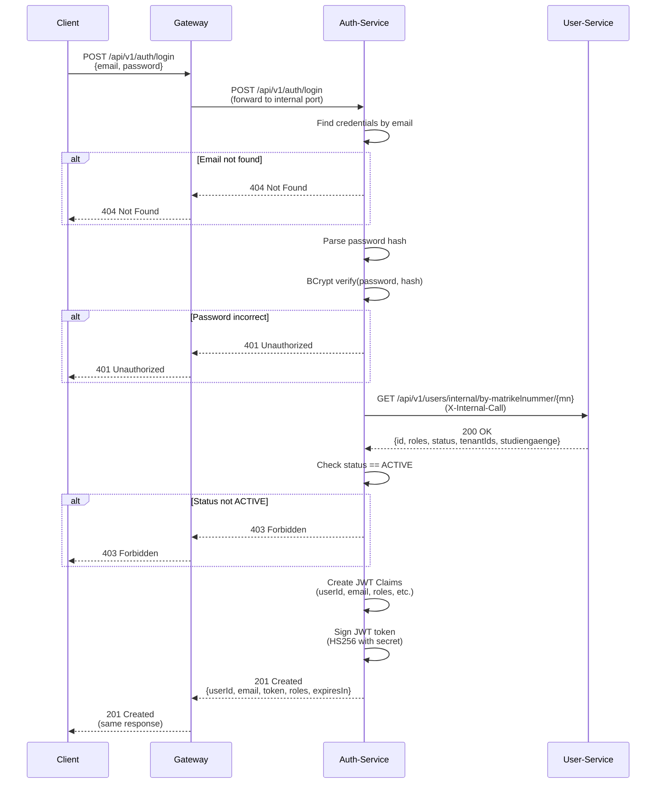
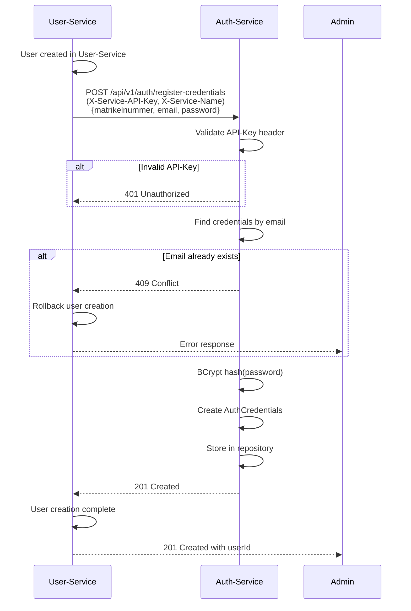
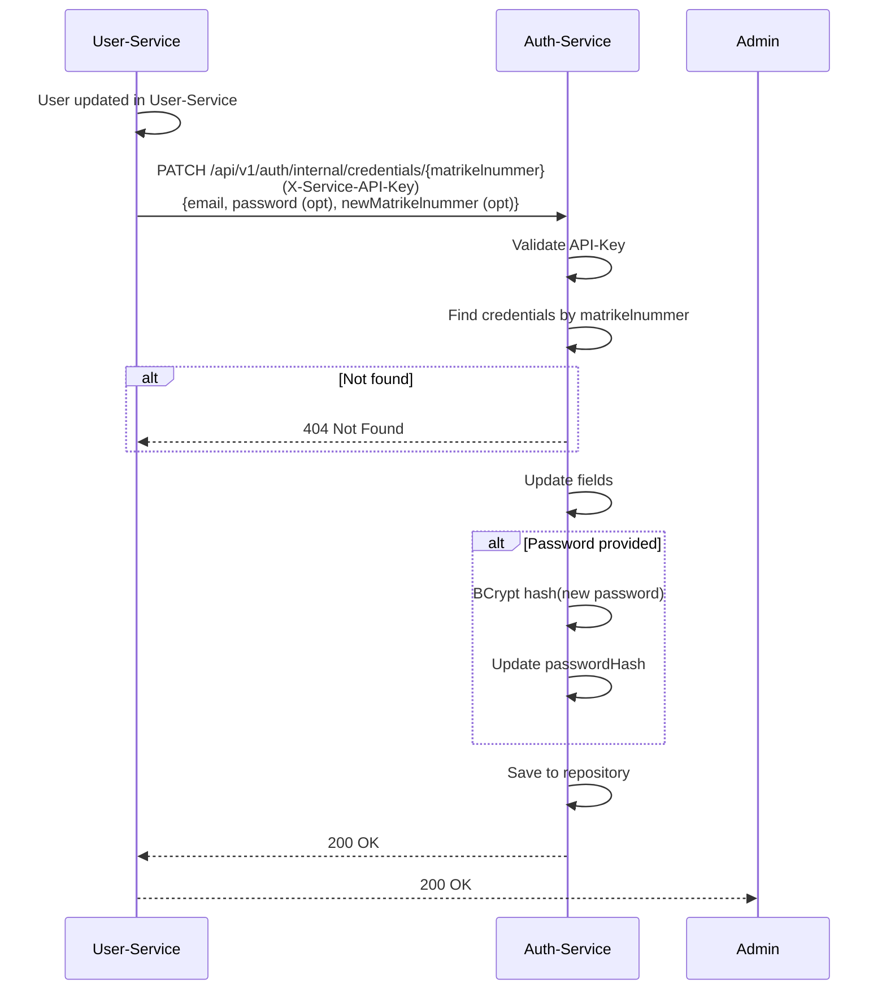
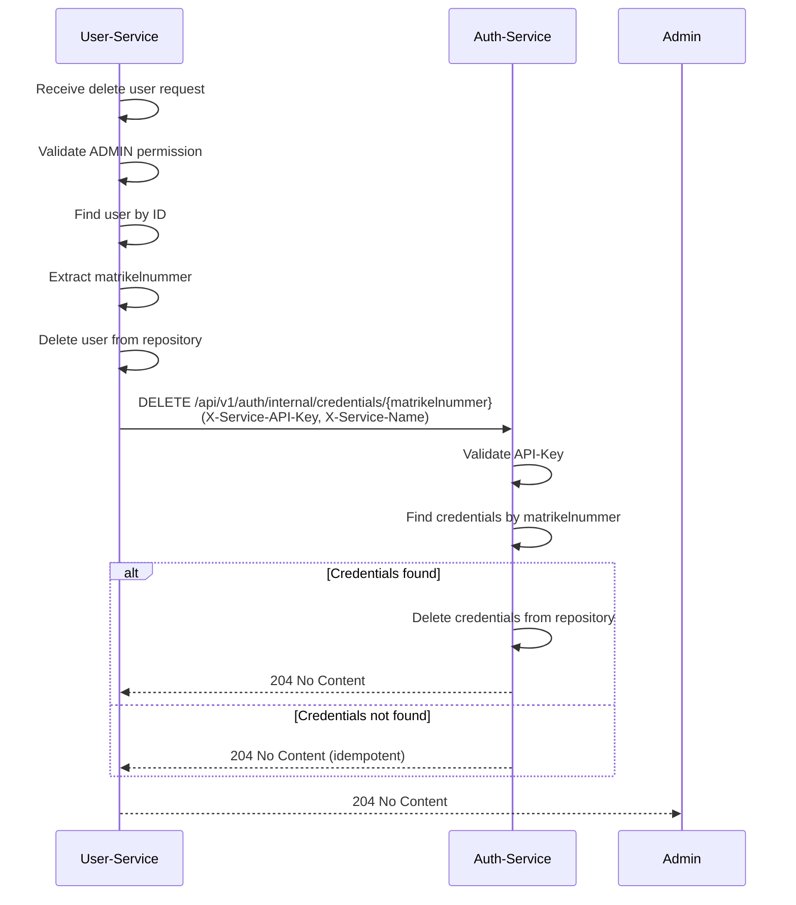

# Auth-Service - Architektur und Schnittstellendefinition

## 1. Übersicht

### 1.1 Zweck des Services
Der Auth-Service ist verantwortlich für:
- Speicherung von Benutzer-Credentials 
- JWT Token-Generierung beim Login
- Password-Hashing und -Validierung
- Identität-Daten Speicherung (userId, Rollen, Tenants, Studiengänge, Status)
- Credential-Synchronisierung mit User-Service
- Email-Uniqueness Validierung
- Internal API für Service-to-Service Authentifizierung

### 1.2 Architektur-Position
```
┌──────────────────────────────────────────────────┐
│         Gateway-Service (Port 8080)              │
│    JWT Validation & X-User-* Headers             │
└────────────────┬─────────────────────────────────┘
                 │
         Client Requests
                 │
┌────────────────▼──────────────────────────────────┐
│  Auth-Service: Login & Credentials (Port 8085)    │
├───────────────────────────────────────────────────┤
│ ▼ Public Endpoints (via Gateway):                 │
│   - POST /api/v1/auth/login (returns JWT)         │
│                                                   │
│ ▼ Internal Endpoints (API-Key auth):              │
│   - POST   /api/v1/auth/register-credentials      │
│   - GET    /api/v1/auth/internal/credentials/{mn} │
│   - PATCH  /api/v1/auth/internal/credentials/{mn} │
│   - DELETE /api/v1/auth/internal/credentials/{mn} │
└────────────┬──────────────────────────────────────┘
             │
      Service-to-Service Call (X-Service-API-Key)
             │
    ┌────────▼───────────────┐
    │ User-Service           │
    │ (Port 8081)            │
    │ Calls during login to: │
    │ GET /internal/by-mn/{} │
    └────────────────────────┘
```

### 1.3 Technologie-Stack
| Komponente | Technologie |
|------------|-------------|
| Framework | Spring Boot 3.x |
| Sprache | Java 17 |
| Token | JWT (JJWT 0.11.5) |
| Hashing | BCrypt |
| Datenbank | In-Memory (Map-based Repository) |
| Build-Tool | Maven |
| Container | Docker |
| Port | 8085 |

---


## 2. Funktionsbeschreibung

### 2.1 Kernfunktionen

| Funktion | Beschreibung | Eingabe | Ausgabe |
|----------|--------------|---------|---------|
| **Login** | Authentifizierung + JWT-Generierung | Email, Password | JWT Token + User-Info |
| **Credentials-Registrierung** | Neue Credentials speichern (internal) | RegisterCredentialsRequest | Void (201) |
| **Credentials-Update** | Credentials aktualisieren (internal) | UpdateCredentialsRequest | Void (200) |
| **Credentials-Löschung** | Credentials löschen (internal) | Matrikelnummer | Void (204) |
| **Credentials-Abruf** | Abruf nach Matrikelnummer (internal) | Matrikelnummer | AuthCredentials |

### 2.2 Geschäftsprozesse

#### Login-Fluss
1. Client sendet POST /api/v1/auth/login (Email + Password)
2. Auth-Service sucht Credentials nach Email
3. Auth-Service validiert:
    - User existiert
    - Password-Hash stimmt überein
4. Auth-Service ruft User-Service intern ab (by matrikelnummer) und validiert:
    - Status ist ACTIVE
    - Tenant-Ids vorhanden (falls nicht ADMIN)
5. Auth-Service generiert JWT-Token mit Claims:
   - userId, email, roles, tenantIds, studiengaenge, matrikelnummer, status
6. JWT wird zurückgegeben (1 Stunde Gültigkeit)

#### Credentials-Registrierung (von User-Service)
1. User-Service sendet POST /api/v1/auth/register-credentials
2. Auth-Service validiert API-Key Header
3. Auth-Service hasht Password mit BCrypt
4. AuthCredentials wird erstellt und in Repository gespeichert
5. 201 Created wird zurückgegeben

#### Credentials-Update (von User-Service)
1. User-Service sendet PATCH /api/v1/auth/internal/credentials/{matrikelnummer}
2. Auth-Service validiert API-Key Header
3. Auth-Service findet Credentials nach Matrikelnummer
4. AuthCredentials wird aktualisiert (Email, Password, neue Matrikelnummer optional)
5. 200 OK wird zurückgegeben

#### Credentials-Löschung (von User-Service)
1. User-Service sendet DELETE /api/v1/auth/internal/credentials/{matrikelnummer}
2. Auth-Service validiert API-Key Header
3. Auth-Service findet und löscht Credentials nach Matrikelnummer
4. 204 No Content wird zurückgegeben 

---

## 3. Architektur-Komponenten

### 3.1 Schichtenmodell
```
┌─────────────────────────────────────────────────────┐
│              Presentation Layer                     │
│  ┌───────────────────────────────────────────┐      │
│  │      AuthController                       │      │
│  │  - POST /api/v1/auth/login                │      │
│  │  - POST /api/v1/auth/register-credentials │      │
│  │  - GET /api/v1/auth/internal/credentials/{mn}    │
│  │  - PATCH /api/v1/auth/internal/credentials/{mn}  │
│  │  - DELETE /api/v1/auth/internal/credentials/{mn} │
│  └───────────────────────────────────────────┘      │
└───────────────────┬─────────────────────────────────┘
                    │
┌───────────────────▼─────────────────────────────────┐
│               Business Layer                        │
│  ┌───────────────────────────────────────────┐      │
│  │    AuthService / AuthCredentialsService   │      │
│  │  - login(email, password)                 │      │
│  │  - registerUserWithRoles(request)         │      │
│  │  - updateUserWithRoles(matrikelnummer)    │      │
│  │  - deleteCredentials(matrikelnummer)      │      │
│  │  - getByEmail(email)                      │      │
│  │  - getByMatrikelnummer(matrikelnummer)    │      │
│  │  - validatePassword(hash, plain)          │      │
│  │  - generateJWT(credentials)               │      │
│  └───────────────────────────────────────────┘      │
│  ┌───────────────────────────────────────────┐      │
│  │      JwtService                           │      │
│  │  - generateToken(userId, email, roles, studiengaenge, tenantIds, mn) │
│  │  - validateToken(token)                   │      │
│  └───────────────────────────────────────────┘      │
└───────────────────┬─────────────────────────────────┘
                    │
┌───────────────────▼────────────────────────────────┐
│              Data Access Layer                     │
│  ┌──────────────────────────────────────────┐      │
│  │  AuthCredentialsRepository               │      │
│  │  - Map<Long, AuthCredentials>            │      │
│  │  - findByMatrikelnummer(matrikelnummer)  │      │
│  │  - findByEmail(email)                    │      │
│  │  - findAll()                             │      │
│  │  - save(credentials)                     │      │
│  │  - delete(matrikelnummer)                │      │
│  └──────────────────────────────────────────┘      │
└────────────────────────────────────────────────────┘
```

### 3.2 Externe Abhängigkeiten
```
┌──────────────────────┐
│  Auth-Service        │
└──────────┬───────────┘
           │
           └──────────► User-Service
                        - Sync via internal endpoints
                        - Credentials Registration/Update/Delete
                        
```

---

## 4. Datenmodell

### 4.1 AuthCredentials Entity
```java
public class AuthCredentials {
    private Long matrikelnummer;              // Primärschlüssel
    private UUID userId;                      // Referenz zu User
    private String email;                     // Eindeutig
    private String passwordHash;              // BCrypt gehashed
    private Set<Role> roles;                  // ADMIN, PRUEFUNGSAMT, STUDENT, LEHRENDER
    private Set<UUID> tenantIds;              // Zugeordnete Fachbereiche
    private Set<String> studiengaenge;        // Eingeschriebene Studiengänge
    private Status status;                    // ACTIVE, INACTIVE, PENDING, SUSPENDED
    private LocalDateTime createdAt;
    private LocalDateTime updatedAt;
}
```

### 4.2 JWT Claims Struktur
```json
{
  "sub": "aaaaaaaa-aaaa-aaaa-aaaa-000000000001",  // userId
  "email": "admin@university.de",
  "role": ["ADMIN"],
  "matrikelnummer": 1,
  "tenant_ids": [],
  "studiengaenge": [],
  "status": "ACTIVE",
  "iat": 3600000,
  "exp": 3600000
}
```

### 4.3 DTO Modelle

**LoginRequest:**
```java
public class LoginRequest {
    private String email;
    private String password;
}
```

**LoginResponse:**
```java
public class LoginResponse {
    private UUID userId;
    private String email;
    private String token;
    private Set<Role> roles;
    private long expiresIn;  // Millisekunden
}
```

**RegisterCredentialsRequest:**
```java
public class RegisterCredentialsRequest {
    private Long matrikelnummer;
    private String email;
    private String password;
}
```

**UpdateCredentialsRequest:**
```java
public class UpdateCredentialsRequest {
    private String email;              // optional
    private String password;           // optional
    private Long newMatrikelnummer;    // optional
}
```

---

## 5. Schnittstellen-Definition


### 5.1 Öffentliche Schnittstellen (für Clients)

| Methode | Endpoint | Beschreibung | Authentifizierung |
|---------|----------|--------------|-------------------|
| POST | `/api/v1/auth/login` | Benutzer-Login | Keine (Public) |

### 5.2 Interne Schnittstellen (Service-zu-Service)

| Methode | Endpoint | Beschreibung | Aufrufer | Authentifizierung |
|---------|----------|--------------|----------|-------------------|
| POST | `/api/v1/auth/register-credentials` | Credentials registrieren | User-Service | API-Key |
| GET | `/api/v1/auth/internal/credentials/{matrikelnummer}` | Abruf nach Matrikelnummer | User-Service | API-Key |
| PATCH | `/api/v1/auth/internal/credentials/{matrikelnummer}` | Credentials aktualisieren | User-Service | API-Key |
| DELETE | `/api/v1/auth/internal/credentials/{matrikelnummer}` | Credentials löschen | User-Service | API-Key |

### 5.3 Header-Anforderungen (Internal)

**Bei internen Aufrufen müssen diese Header gesetzt sein:**
```
X-Service-API-Key: {api-key-value}
X-Service-Name: user-service
Content-Type: application/json
```

---

## 6. User Stories

### US-AUTH-01: Admin loggt sich ein
**Als** Administrator  
**möchte ich** mich mit Email und Password einloggen  
**damit** ich einen JWT-Token bekommen für weitere API-Calls

**Akzeptanzkriterien:**
- [x] Email/Password Validierung funktioniert
- [x] Password wird als BCrypt-Hash verglichen
- [x] JWT wird generiert mit 1h Gültigkeit
- [x] JWT enthält alle Claims (userId, roles, tenantIds, etc.)
- [x] 201 Created wird zurückgegeben mit Token

### US-AUTH-02: Student loggt sich ein
**Als** Student  
**möchte ich** mich anmelden um die Plattform zu nutzen  
**damit** kann ich meine Noten und Module sehen

**Akzeptanzkriterien:**
- [x] Login mit gültiger Email/Password funktioniert
- [x] JWT enthält Studiengang-Information
- [x] JWT läuft nach 1 Stunde ab
- [x] Inactive User können sich nicht einloggen
- [x] 401 Unauthorized bei falshem Password
- [x] 404 Not Found bei falscher Email

### US-AUTH-03: Credentials-Registrierung (internal)
**Als** User-Service  
**möchte ich** neue Credentials im Auth-Service speichern  
**damit** der User sich später einloggen kann

**Akzeptanzkriterien:**
- [x] POST /api/v1/auth/register-credentials mit API-Key
- [x] Email-Uniqueness wird validiert
- [x] Password wird mit BCrypt gehasht
- [x] 201 Created wird zurückgegeben
- [x] Credentials sind sofort abrufbar

### US-AUTH-04: Credentials-Update (internal)
**Als** User-Service  
**möchte ich** Credentials aktualisieren wenn User-Daten ändern  
**damit** bleibt die Identity-Information in Sync

**Akzeptanzkriterien:**
- [x] PATCH /api/v1/auth/internal/credentials/{matrikelnummer}
- [x] Email, Password, neue Matrikelnummer können aktualisiert werden
- [x] Matrikelnummer kann optional geaendert werden (newMatrikelnummer)
- [x] 200 OK wird zurückgegeben
- [x] Changes wirken beim nächsten Login

### US-AUTH-05: Email-Duplikat Prävention (bei Registrierung)
**Als** User-Service  
**möchte ich** sicherstellen dass Email nicht doppelt existiert  
**damit** keine Verwechslungen entstehen

**Akzeptanzkriterien:**
- [x] POST /api/v1/auth/register-credentials prueft Email-Uniqueness
- [x] Duplikat fuehrt zu 409 Conflict
- [x] Check ist case-insensitive
- [x] Auch inaktive Credentials werden gefunden
- [x] Schnell (< 100ms)

### US-AUTH-06: Credentials-Löschung (internal)
**Als** User-Service  
**möchte ich** Credentials löschen wenn ein User permanent gelöscht wird  
**damit** keine verwaisten Credentials im System bleiben

**Akzeptanzkriterien:**
- [x] DELETE /api/v1/auth/internal/credentials/{matrikelnummer} mit API-Key
- [x] Credentials werden permanent gelöscht
- [x] 204 No Content wird zurückgegeben
- [x] Idempotent: Wiederholte Aufrufe geben auch 204
- [x] Synchron mit User-Löschung im User-Service

### US-AUTH-07: Allgemeiner User erhält Login-Informationen mit Token-Details
**Als** Nutzer (beliebige Rolle)  
**möchte ich** beim erfolgreichem Login meine Rollen, Token-Ablaufzeit und User-ID erhalten  
**damit** ich weiß, welche Berechtigungen ich habe und wann ich mich neu anmelden muss

**Akzeptanzkriterien:**
- [x] POST /api/v1/auth/login gibt LoginResponse mit allen Claims zurück
- [x] Response enthält: userId, email, roles, token, expiresIn
- [x] Token ist ein gültiger JWT mit 1h Gültigkeit
- [x] expiresIn gibt Zeit in Millisekunden an (3600000 = 1h)
- [x] Roles sind die zugewiesenen Rollen (ADMIN, STUDENT, LEHRENDER, PRUEFUNGSAMT)
- [x] 201 Created wird zurückgegeben
- [x] Client kann Ablaufzeit zum Anzeigen verwenden ("Token läuft ab in X Minuten")

---

## 7. Sequenzdiagramme

### 7.1 Login-Fluss


### 7.2 Credentials-Registrierung (Internal)


### 7.3 Credentials-Update (Internal)


### 7.4 Credentials-Löschung (von User-Service)


---

## 8. Sicherheitskonzept

### 8.1 Password-Sicherheit
- **Hashing:** BCrypt mit automatischem Salt (cost factor: 10)
- **Transmission:** Nur über HTTPS (in Production)
- **Storage:** Nur Hashes, nie Plain-Text
- **Vergleich:** BCrypt.matches() für timing-attack Schutz

### 8.2 JWT Token-Sicherheit
- **Signatur:** HMAC SHA-256 (HS256)
- **Secret:** Minimum 256-bit (32 bytes)
- **Encoding:** Base64 URL-safe
- **Claims:** Sub, Email, Roles, Tenants, Studiengänge, Matrikelnummer
- **Expiration:** 1 Stunde (3600 Sekunden)
- **IssuedAt:** Gespeichert für Refresh-Validierung

### 8.3 API-Key Security (Internal)
- **Header:** X-Service-API-Key + X-Service-Name
- **Validation:** Beide Header müssen exakt passen
- **Storage:** Environment Variables (nicht hard-coded)
- **Rotation:** Manuell definierbar

### 8.4 Rollen-basierte Zugriffskontrolle
- **Login Endpoint:** Public (keine auth nötig)
- **Internal Endpoints:** Nur mit gültigem API-Key
- **Claims-Validation:** JWT-Validation vor Response

---

## 9. Fehlerbehandlung

| HTTP Status | Fehler | Beschreibung |
|-------------|--------|--------------|
| 400 | Bad Request | Ungültige Eingabedaten |
| 401 | Unauthorized | Falsches Password / Ungültiger API-Key |
| 403 | Forbidden | User inactive / Tenant inactive |
| 404 | Not Found | Email nicht gefunden / Matrikelnummer nicht gefunden |
| 409 | Conflict | Email existiert bereits |
| 500 | Internal Server Error | Fehler im JWT-Generierung |

**Fehler-Response Format:**
```json
{
  "error": "Unauthorized",
  "message": "Invalid email or password",
  "status": 401,
  "timestamp": "2026-02-15T12:00:00Z"
}
```

---

## 10. Validierungsregeln

### 10.1 Login
```
- email: not null, valid email format, must exist
- password: not null, min 1 character
- result: password hash must match
```

### 10.2 Credentials-Registrierung
```
- email: not null, valid email format, unique
- password: not null, min 8 chars, pattern requirements
- matrikelnummer: not null, unique
- roles: min 1 role required
- tenantIds: optional (ADMIN can be empty)
```

### 10.3 Credentials-Update
```
- matrikelnummer: read-only
- email: optional (unique if provided)
- password: optional (hashed if provided)
- roles: min 1 role required
- status: must be valid Status enum
```

---

## 11. Deployment-Konfiguration

### 11.1 Environment Variables
```yaml
JWT_SECRET: "min-256-bit-secret-key-stored-securely"
JWT_EXPIRATION_MS: 3600000  # 1 hour
API_KEY_NAME: "auth-service"
API_KEY_VALUE: "auth-service-api-key"
BCRYPT_STRENGTH: 10
```

### 11.2 Docker Configuration
```yaml
auth-service:
  build: ./auth-service
  ports:
    - "8085:8085"
  environment:
    - JWT_SECRET=${JWT_SECRET}
    - JWT_EXPIRATION_MS=3600000
    - API_KEY_NAME=auth-service
    - API_KEY_VALUE=${API_KEY_VALUE}
  depends_on: []
```

---

## 12. Test-Daten

Bei Startup werden Test-Credentials initialisiert:

| Email | Password | Rolle | Tenant | Status |
|-------|----------|-------|--------|--------|
| admin@university.de | AdminPassword123! | ADMIN | - | ACTIVE |
| pruefungsamt@university.de | PruefungPassword123! | PRUEFUNGSAMT | FB3-DEPT | ACTIVE |
| student@university.de | StudentPassword123! | STUDENT | FB3-DEPT | ACTIVE |
| lehrender@university.de | LehrenderPassword123! | LEHRENDER | FB3-DEPT | ACTIVE |
| inactive@university.de | InactivePassword123! | STUDENT | FB3-DEPT | INACTIVE |

---

## 13. Testing-Strategie

### 13.1 Unit Tests
- AuthService.login() mit verschiedenen Szenarien
- BCrypt password hashing und verify
- JWT token generation und claims
- Email uniqueness validation

### 13.2 Integration Tests
- Login mit User-Service Sync
- Credentials registration
- Credentials update
- API-Key validation

### 13.3 Test-Szenarien
```
✓ Erfolgreicher Login mit gültigen Credentials
✓ Login mit falscher Email (404)
✓ Login mit falscher Password (401)
✓ Login mit inaktivem User (403)
✓ JWT enthält alle Claims
✓ JWT läuft nach 1 Stunde ab
✓ Internal Registrierung mit API-Key
✓ Internal Registrierung ohne API-Key (401)
✓ Email-Duplikat wird erkannt (409)
✓ Update-Operationen synced korrekt
✓ Credentials-Löschung mit DELETE /internal/credentials/{matrikelnummer}
✓ Credentials-Löschung ist idempotent (mehrfache DELETE-Aufrufe)
✓ Credentials-Löschung ohne API-Key (401)
```
---

## 14. Für was wurde die KI im Projekt genutzt

- Code-Generierung: erste Implementierungen, Hilfsfunktionen, Endpunkt-Skelette
- Code-Ueberpruefung: schnelle Plausibilitaetschecks, Edge-Case Hinweise, Sicherheitschecks
- Dokumentation: Architekturtexte, Endpunktlisten, Sequenzdiagramme
- Die fachlichen Inhalte, Architekturentscheidungen und technische Spezifikation wurden eigenständig erarbeitet.