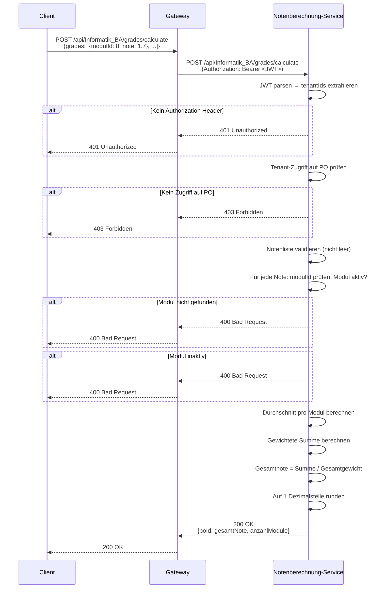
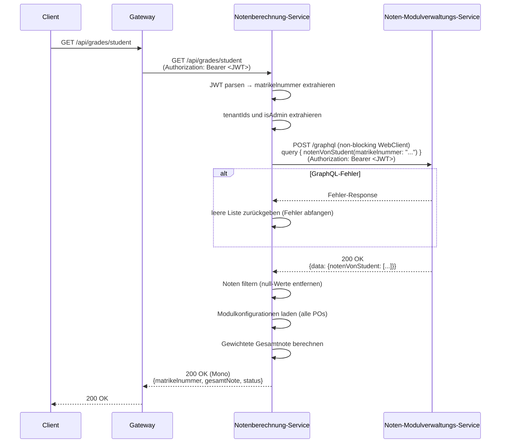
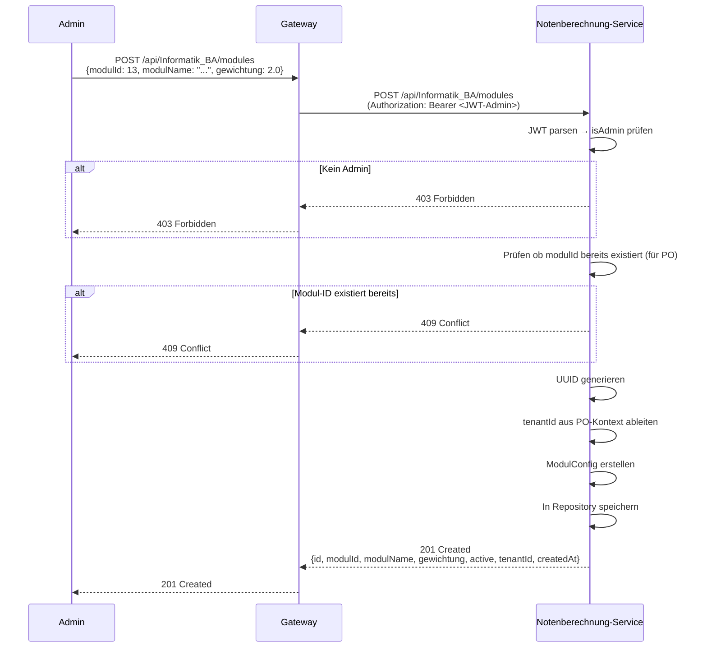
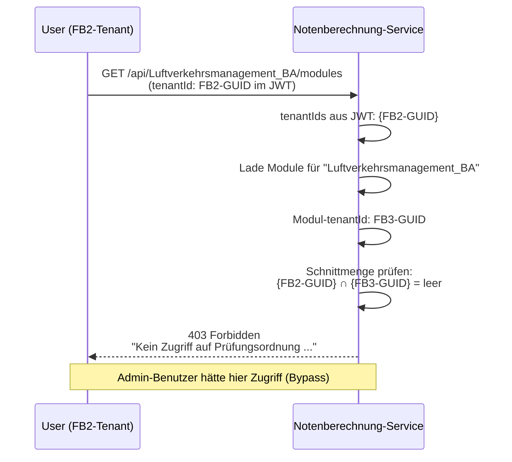

# Notenberechnung-Service - Architektur und Schnittstellendefinition

## 1. Übersicht

### 1.1 Zweck des Services
Der Notenberechnung-Service ist verantwortlich für:
- Berechnung gewichteter Gesamtnoten pro Prüfungsordnung (PO)
- Verwaltung von Modulkonfigurationen (Gewichtungen, Aktivstatus)
- Tenant-basierte Zugriffskontrolle per JWT
- Integration mit dem Noten-Modulverwaltungs-Service über GraphQL
- Bereitstellung studentenspezifischer Notenberechnungen (reaktiv/async)

### 1.2 Architektur-Position
```
┌─────────────────────────────────────────────────────────────┐
│                      Gateway-Service                        │
│         (JWT-Validation & X-User-* Headers)                 │
└─────────────────────┬───────────────────────────────────────┘
                      │
                      ▼
         ┌────────────────────────────┐
         │   Notenberechnung-Service  │
         │  (Gewichtete Notenberech.) │
         │   Port: 8083               │
         └────────────┬───────────────┘
                      │
        ┌─────────────┴──────────────┐
        │                            │
        ▼                            ▼
    Auth-Service              Noten-Modulverwaltungs-Service
    (JWT Secret Sync)         (GraphQL: notenVonStudent)
                              Port: 8082
```

### 1.3 Technologie-Stack
| Komponente | Technologie |
|------------|-------------|
| Framework | Spring Boot 3.5.x |
| Sprache | Java 17 |
| Web | Spring WebFlux (reaktiv) |
| HTTP-Client | WebClient (non-blocking) |
| GraphQL-Client | Spring GraphQL + WebClient |
| Authentifizierung | JWT (JJWT 0.11.5) |
| Datenbank | In-Memory (Map-based Repository) |
| Build-Tool | Maven |
| Container | Docker (Multi-Stage Build) |
| Port | 8083 |

---

## 2. Funktionsbeschreibung

### 2.1 Kernfunktionen

| Funktion | Beschreibung | Eingabe | Ausgabe |
|----------|--------------|---------|---------|
| **Notenberechnung (synchron)** | Gewichtete Gesamtnote aus manuellen Eingaben | PO-ID, Notenliste | Gesamtnote + Metadaten |
| **Notenberechnung (async/GraphQL)** | Gesamtnote aus GraphQL-Abfrage | PO-ID, Matrikelnummer | Mono<Gesamtnote> |
| **Studentenspezifische Note** | Gesamtnote für eingeloggten Studenten | JWT (Matrikelnummer) | Mono<Gesamtnote> |
| **Modul anlegen** | Neues Modul für PO erstellen | PO-ID, Modulkonfiguration | ModulConfig (201) |
| **Modul bearbeiten** | Name/Gewichtung eines Moduls aktualisieren | PO-ID, Modul-ID, Patch | ModulConfig (200) |
| **Modul aktivieren/deaktivieren** | Aktiv-Status eines Moduls umschalten | PO-ID, Modul-ID, active | ModulConfig (200) |
| **Module auflisten** | Alle oder nur aktive Module einer PO | PO-ID | Liste von ModulConfig |
| **Modul löschen** | Modul aus einer PO entfernen | PO-ID, Modul-ID | Void (204) |

### 2.2 Geschäftsprozesse

#### Notenberechnung (synchron)
1. Client sendet POST `/api/{poId}/grades/calculate` mit Notenliste
2. Service extrahiert Tenant-IDs aus JWT-Header
3. Service prüft Zugriff auf PO (Tenant-Matching)
4. Für jede Eingabe: Modul-ID validieren, Modul auf aktiv prüfen
5. Mehrere Noten pro Modul: Durchschnitt berechnen
6. Gewichtete Summe berechnen: Σ(Durchschnitt × Gewichtung)
7. Gewichteten Durchschnitt zurückgeben: Summe / Gesamtgewicht
8. Ergebnis auf 1 Dezimalstelle runden, als Response zurückgeben

#### Notenberechnung via GraphQL (async)
1. Client sendet GET `/api/{poId}/grades/student?matrikelnummer=<id>`
2. Service extrahiert Tenant-IDs und Admin-Flag aus JWT
3. Service ruft noten-modulverwaltungs-service via GraphQL ab
4. Antwort enthält alle Noten des Studenten (Mono-Stream)
5. Noten werden gefiltert und gewichtet berechnet
6. Ergebnis als reaktives Mono zurückgegeben

#### Modul-Verwaltung (Admin)
1. Admin sendet POST/PUT/PATCH/DELETE auf `/api/{poId}/modules/...`
2. Service validiert Admin-Rolle aus JWT
3. Admin-Benutzer umgehen Tenant-Prüfungen (globaler Zugriff)
4. Operation wird auf In-Memory-Repository angewendet
5. Entsprechende HTTP-Antwort zurückgegeben

---

## 3. Architektur-Komponenten

### 3.1 Schichtenmodell
```
┌──────────────────────────────────────────────────────────────┐
│                    Presentation Layer                        │
│  ┌──────────────────────────────────────────────────────┐    │
│  │  NotenController (/api/{poId})                       │    │
│  │  - POST   /grades/calculate                          │    │
│  │  - GET    /grades/student?matrikelnummer=<id>        │    │
│  │  - POST   /modules                                   │    │
│  │  - GET    /modules                                   │    │
│  │  - GET    /modules/active                            │    │
│  │  - GET    /modules/{modulId}                         │    │
│  │  - PUT    /modules/{modulId}                         │    │
│  │  - PATCH  /modules/{modulId}/active                  │    │
│  │  - DELETE /modules/{modulId}                         │    │
│  └──────────────────────────────────────────────────────┘    │
│  ┌──────────────────────────────────────────────────────┐    │
│  │  StudentGradesController (/api/grades)               │    │
│  │  - GET /student  (JWT-Matrikelnummer)                │    │
│  └──────────────────────────────────────────────────────┘    │
└──────────────────────────┬───────────────────────────────────┘
                           │
┌──────────────────────────▼───────────────────────────────────┐
│                     Business Layer                           │
│  ┌──────────────────────────────────────────────────────┐    │
│  │  NotenService                                        │    │
│  │  - berechneGesamtnote(poId, eingabe, tenantIds)      │    │
│  │  - berechneGesamtnoteViaGraphQLAsync(...)            │    │
│  │  - legeModulAn(poId, modul, tenantIds, isAdmin)      │    │
│  │  - bearbeiteModul(poId, modulId, patch, ...)         │    │
│  │  - setzeModulAktiv(poId, modulId, active, ...)       │    │
│  │  - alleModule(poId, tenantIds, isAdmin)              │    │
│  │  - aktiveModule(poId, tenantIds, isAdmin)            │    │
│  │  - loescheModul(poId, modulId, tenantIds, isAdmin)   │    │
│  │  - findeModul(poId, modulId, tenantIds, isAdmin)     │    │
│  └──────────────────────────────────────────────────────┘    │
│  ┌──────────────────────────────────────────────────────┐    │
│  │  GraphQLClientService                                │    │
│  │  - getNotenVonStudent(matrikelnummer, authHeader)    │    │
│  └──────────────────────────────────────────────────────┘    │
│  ┌──────────────────────────────────────────────────────┐    │
│  │  JwtTenantService                                    │    │
│  │  - extractTenantIds(authorizationHeader)             │    │
│  │  - isAdmin(authorizationHeader)                      │    │
│  │  - extractMatrikelnummer(authorizationHeader)        │    │
│  └──────────────────────────────────────────────────────┘    │
└──────────────────────────┬───────────────────────────────────┘
                           │
┌──────────────────────────▼───────────────────────────────────┐
│                    Data Access Layer                         │
│  ┌──────────────────────────────────────────────────────┐    │
│  │  ModulGewichtungsRepository                          │    │
│  │  - Map<String, Map<Integer, ModulConfig>>            │    │
│  │    (poId → modulId → config)                         │    │
│  │  - getModulesForPo(poId)                             │    │
│  │  - saveModule(poId, modul)                           │    │
│  │  - allModules(poId)                                  │    │
│  │  - activeModules(poId)                               │    │
│  │  - findByModulId(poId, modulId)                      │    │
│  │  - deleteModule(poId, modulId)                       │    │
│  │  - setModuleActive(poId, modulId, active)            │    │
│  │  - getAllPoIds()                                      │    │
│  └──────────────────────────────────────────────────────┘    │
└──────────────────────────────────────────────────────────────┘
```

### 3.2 Externe Abhängigkeiten
```
┌──────────────────────────────┐
│  Notenberechnung-Service     │
└──────────────┬───────────────┘
               │
               ├──────────────► Noten-Modulverwaltungs-Service
               │                - GraphQL Endpoint: /graphql (Port 8082)
               │                - Query: notenVonStudent(matrikelnummer)
               │                - JWT wird weitergeleitet
               │
               └──────────────► Auth-Service (indirekt)
                                - JWT Secret muss übereinstimmen
                                - Kein direkter REST-Call
```

---

## 4. Datenmodell

### 4.1 ModulConfig (Entität)
```java
public class ModulConfig {
    private String id;               // Interne UUID (auto-generiert)
    private Integer modulId;         // Offizielle Modul-Nummer (z.B. 30)
    private String modulName;        // Name des Moduls
    private double gewichtung;       // Gewichtungsfaktor (z.B. ECTS-Punkte)
    private boolean active;          // Aktiv/Inaktiv (Standard: true)
    private String tenantId;         // Zugeordneter Fachbereich (UUID)
    private LocalDateTime createdAt; // Erstellungszeitpunkt
}
```

### 4.2 Berechnungsformel
```
Gesamtnote = Σ(Durchschnittsnote_Modul × Gewichtung_Modul)
             ─────────────────────────────────────────────
                       Σ(Gewichtung_Modul)

Mehrere Noten pro Modul:
  Durchschnitt = (Note1 + Note2 + ... + NoteN) / N
  → Dann Durchschnitt in obige Formel einsetzen
```

**Beispiel:**
```
Module:
  Modul 1 "Mathematik"  (Gewichtung: 5,  Note: 1,0)
  Modul 2 "Informatik"  (Gewichtung: 10, Note: 2,0)

Berechnung:
  (1,0 × 5 + 2,0 × 10) / (5 + 10)
  = (5,0 + 20,0) / 15,0
  = 25,0 / 15,0
  = 1,666...
  → Ergebnis: 1,7
```

### 4.3 DTO Modelle

**NotenEingabe (Request):**
```java
public class NotenEingabe {
    @JsonProperty("grades")
    @JsonAlias({"notenListe", "notenliste"})
    private List<EinzelNote> notenListe;

    public static class EinzelNote {
        private Integer modulId;
        private double note;
        private String createdAt;  // optional
    }
}
```

**GraphQLNote (GraphQL-Antwort):**
```java
public class GraphQLNote {
    private String id;
    private String matrikelnummer;
    private String tenantId;
    private String modulId;
    private String modulName;
    private String lehrendenMatrikelnummer;
    private Double note;
    private String status;
    private String studiengang;
    private String semester;
    private String erstelltAm;
    private String aktualisiertAm;
}
```

---

## 5. Schnittstellen-Definition

### 5.1 Notenberechnung-Endpoints

| Methode | Endpoint | Beschreibung | Authentifizierung |
|---------|----------|--------------|-------------------|
| POST | `/api/{poId}/grades/calculate` | Gewichtete Gesamtnote aus Eingaben berechnen | Bearer JWT |
| GET | `/api/{poId}/grades/student` | Gesamtnote via GraphQL abrufen | Bearer JWT |
| GET | `/api/grades/student` | Gesamtnote für eingeloggten Studenten (JWT-Matrikelnummer) | Bearer JWT |

**POST `/api/{poId}/grades/calculate` - Request:**
```json
{
  "grades": [
    { "modulId": 8, "note": 1.7 },
    { "modulId": 9, "note": 2.3 }
  ]
}
```

**POST `/api/{poId}/grades/calculate` - Response:**
```json
{
  "poId": "Informatik_BA",
  "gesamtNote": 2.0,
  "anzahlModule": 2
}
```

**GET `/api/grades/student` - Response:**
```json
{
  "matrikelnummer": "12345678",
  "gesamtNote": 2.1,
  "status": "Berechnung erfolgreich"
}
```

### 5.2 Modul-Verwaltungs-Endpoints

| Methode | Endpoint | Beschreibung | Rolle |
|---------|----------|--------------|-------|
| POST | `/api/{poId}/modules` | Neues Modul erstellen | ADMIN |
| GET | `/api/{poId}/modules` | Alle Module auflisten | Alle |
| GET | `/api/{poId}/modules/active` | Nur aktive Module | Alle |
| GET | `/api/{poId}/modules/{modulId}` | Einzelnes Modul abrufen | Alle |
| PUT | `/api/{poId}/modules/{modulId}` | Modul vollständig aktualisieren | ADMIN |
| PATCH | `/api/{poId}/modules/{modulId}/active` | Aktiv-Status umschalten | ADMIN |
| DELETE | `/api/{poId}/modules/{modulId}` | Modul löschen | ADMIN |

**POST/PUT `/api/{poId}/modules` - Request:**
```json
{
  "modulId": 13,
  "modulName": "Neues Modul",
  "gewichtung": 2.0,
  "active": true
}
```

**POST `/api/{poId}/modules` - Response (201 Created):**
```json
{
  "id": "550e8400-e29b-41d4-a716-446655440000",
  "modulId": 13,
  "modulName": "Neues Modul",
  "gewichtung": 2.0,
  "active": true,
  "tenantId": "11111111-1111-1111-1111-111111111111",
  "createdAt": "2026-02-21T10:30:00"
}
```

**PATCH `/api/{poId}/modules/{modulId}/active` - Request:**
```json
{
  "active": false
}
```

### 5.3 GraphQL-Abfrage (intern, an noten-modulverwaltungs-service)

```graphql
query {
  notenVonStudent(matrikelnummer: "12345678") {
    id
    matrikelnummer
    tenantId
    modulId
    modulName
    note
    status
    erstelltAm
    aktualisiertAm
  }
}
```

### 5.4 Header-Anforderungen

**Bei allen Requests muss dieser Header gesetzt sein:**
```
Authorization: Bearer <JWT-Token>
Content-Type: application/json
```

---

## 6. User Stories

### US-NOTEN-01: Student berechnet seine Gesamtnote
**Als** Student
**möchte ich** meine gewichtete Gesamtnote für meine Prüfungsordnung berechnen
**damit** ich meinen aktuellen Notendurchschnitt kenne

**Akzeptanzkriterien:**
- [x] POST `/api/{poId}/grades/calculate` mit Notenliste möglich
- [x] Gewichtung der Module wird berücksichtigt
- [x] Mehrere Noten pro Modul werden gemittelt
- [x] Nur aktive Module werden einbezogen
- [x] Ergebnis auf 1 Dezimalstelle gerundet
- [x] 400 Bad Request bei ungültigen Noten (< 1.0 oder > 5.0)

### US-NOTEN-02: Student ruft automatische Notenberechnung ab
**Als** Student
**möchte ich** meine Gesamtnote automatisch aus meinen eingetragenen Noten berechnen lassen
**damit** ich keine Noten manuell eingeben muss

**Akzeptanzkriterien:**
- [x] GET `/api/grades/student` mit JWT möglich (Matrikelnummer wird aus Token gelesen)
- [x] Noten werden via GraphQL vom noten-modulverwaltungs-service abgerufen
- [x] Berechnung ist reaktiv/non-blocking
- [x] Fehlende Noten werden übersprungen
- [x] 401 Unauthorized ohne gültigen JWT

### US-NOTEN-03: Admin legt Modulkonfiguration an
**Als** Administrator
**möchte ich** Modulkonfigurationen (Name, Gewichtung) für eine Prüfungsordnung anlegen
**damit** die Notenberechnung korrekte Gewichte verwendet

**Akzeptanzkriterien:**
- [x] POST `/api/{poId}/modules` mit Admin-JWT möglich
- [x] Modul-ID muss eindeutig pro PO sein (409 Conflict bei Duplikat)
- [x] 201 Created mit vollständiger ModulConfig zurückgegeben
- [x] 403 Forbidden wenn kein Admin-Token

### US-NOTEN-04: Admin deaktiviert ein Modul
**Als** Administrator
**möchte ich** ein Modul deaktivieren können
**damit** es nicht mehr in Berechnungen einfließt (ohne es zu löschen)

**Akzeptanzkriterien:**
- [x] PATCH `/api/{poId}/modules/{modulId}/active` mit `{"active": false}`
- [x] Deaktiviertes Modul erscheint in `/modules`, nicht in `/modules/active`
- [x] Notenberechnung wirft Fehler bei inaktivem Modul
- [x] 403 Forbidden wenn kein Admin-Token

### US-NOTEN-05: Tenant-Isolation zwischen Fachbereichen
**Als** Benutzer eines Fachbereichs
**möchte ich** nur auf die Prüfungsordnungen meines Fachbereichs zugreifen
**damit** keine unautorisierten Zugriffe auf andere Fachbereiche möglich sind

**Akzeptanzkriterien:**
- [x] Tenant-IDs werden aus JWT extrahiert
- [x] Zugriff auf PO nur wenn Tenant-ID des Moduls im JWT enthalten
- [x] 403 Forbidden bei Tenant-Mismatch
- [x] Admin-Benutzer haben Zugriff auf alle POs

---

## 7. Sequenzdiagramme

### 7.1 Synchrone Notenberechnung


### 7.2 Studentenspezifische Notenberechnung (reaktiv/GraphQL)


### 7.3 Modul-Erstellung (Admin)


### 7.4 Tenant-Zugriffskontrolle


---

## 8. Sicherheitskonzept

### 8.1 JWT-Validierung
- **Algorithmus:** HMAC SHA-256 (HS256)
- **Secret:** Muss mit Auth-Service übereinstimmen (via `JWT_SECRET` Env-Variable)
- **Claims genutzt:** `tenant_ids`, `role`, `matrikelnummer`
- **Token-Format:** `Bearer <token>` im `Authorization`-Header

### 8.2 Tenant-basierte Zugriffskontrolle
- Jedes Modul ist einem Tenant (Fachbereich) zugeordnet
- Zugriff auf PO nur erlaubt wenn JWT-Tenant-IDs den Modul-Tenant enthält
- **Admin-Bypass:** ADMIN-Rolle im JWT erlaubt Zugriff auf alle POs unabhängig von Tenant-IDs
- Leere `tenant_ids` führen zu 403 Forbidden (außer Admin)

### 8.3 Rollen-basierte Kontrolle
| Aktion | Student | Lehrender | Prüfungsamt | Admin |
|--------|---------|-----------|-------------|-------|
| Noten berechnen | ✓ | ✓ | ✓ | ✓ |
| Module auflisten | ✓ | ✓ | ✓ | ✓ |
| Module erstellen | ✗ | ✗ | ✗ | ✓ |
| Module bearbeiten | ✗ | ✗ | ✗ | ✓ |
| Module löschen | ✗ | ✗ | ✗ | ✓ |

### 8.4 GraphQL-Sicherheit
- JWT-Token wird unverändert an noten-modulverwaltungs-service weitergeleitet
- Kein API-Key (Service-zu-Service läuft über JWT-Delegation)
- Fehler beim GraphQL-Call führen zu leerer Notenliste (kein Hard-Fail)

---

## 9. Fehlerbehandlung

| HTTP Status | Fehler | Beschreibung |
|-------------|--------|--------------|
| 400 | Bad Request | Ungültige Noten / fehlende Modul-ID / leere Notenliste |
| 401 | Unauthorized | Fehlender oder ungültiger JWT |
| 403 | Forbidden | Kein Zugriff auf PO / fehlender Tenant im JWT |
| 404 | Not Found | Modul nicht gefunden |
| 409 | Conflict | Modul-ID existiert bereits in dieser PO |
| 500 | Internal Server Error | Unerwarteter Fehler |

**Fehler-Response Format:**
```json
{
  "timestamp": "2026-02-21T12:00:00.000",
  "status": 400,
  "error": "Bad Request",
  "message": "ungültige note: 6.0 (erlaubt: 1.0–5.0)",
  "service": "notenberechnung-service"
}
```

**Spezifische Fehlermeldungen:**

| Bedingung | Status | Meldung |
|-----------|--------|---------|
| Notenliste leer | 400 | `grades/notenListe ist leer` |
| Modul-ID fehlt | 400 | `modulId fehlt in einer Note` |
| Note außerhalb [1.0–5.0] | 400 | `ungültige note: X (erlaubt: 1.0–5.0)` |
| Modul nicht gefunden | 400 | `Modul nicht gefunden für modulId: X` |
| Modul inaktiv | 400 | `Modul ist inaktiv und kann nicht bewertet werden: X` |
| Summe Gewichte = 0 | 400 | `Summe der Gewichte ist 0` |
| Kein Authorization-Header | 401 | `Authorization Header 'Bearer <token>' wird benötigt` |
| Ungültiger JWT | 401 | `JWT Token ist ungültig oder abgelaufen` |
| Kein Tenant im JWT | 403 | `Kein Tenant im JWT hinterlegt` |
| Tenant-Mismatch | 403 | `Kein Zugriff auf Prüfungsordnung X für diese Tenant-IDs` |
| Modul-ID doppelt | 409 | `Modul mit ID X existiert bereits in PO Y` |
| Modul nicht gefunden (Delete) | 404 | `Modul nicht gefunden: X` |

---

## 10. Validierungsregeln

### 10.1 Notenberechnung
```
- grades: nicht leer (mind. 1 EinzelNote)
- modulId: nicht null, muss in PO existieren, Modul muss aktiv sein
- note: Wert zwischen 1.0 (inkl.) und 5.0 (inkl.)
- poId: muss gültige PO mit konfigurierten Modulen sein
- tenantId im JWT muss mit Modul-Tenant übereinstimmen
```

### 10.2 Modul-Erstellung
```
- modulId: nicht null, eindeutig pro PO
- modulName: nicht leer
- gewichtung: > 0
- active: optional (Standard: true)
- Nur Admin darf anlegen
```

### 10.3 Modul-Update
```
- poId + modulId: muss existieren
- modulName: optional
- gewichtung: optional, wenn angegeben > 0
- Nur Admin darf bearbeiten
```

### 10.4 JWT-Validierung
```
- Authorization Header: "Bearer <token>" Format
- JWT Signatur: HMAC SHA-256 mit konfigurierten Secret
- Claims: tenant_ids (Set<UUID>), role (String/List), matrikelnummer
- Admin: role enthält "ADMIN"
```

---

## 11. Deployment-Konfiguration

### 11.1 Environment Variables
```yaml
JWT_SECRET: "min-256-bit-secret-key-stored-securely"  # Muss mit Auth-Service übereinstimmen
GRAPHQL_CLIENT_URL: "http://noten-modulverwaltungs-service:8082/graphql"
```

### 11.2 application.yaml
```yaml
server:
  port: 8083

spring:
  application:
    name: notenberechnung-service

app:
  modules-source: class  # Quelle für Seed-Daten (class = ModulesSeedData)

jwt:
  secret: ${JWT_SECRET:meinSuperGeheimerSchluessel1234567890ABCDEFGHIJKLMNOPQRSTUVWXYZ}

graphql:
  client:
    url: "http://localhost:8082/graphql"
```

### 11.3 Docker Configuration
```yaml
notenberechnung-service:
  build: ./notenberechnung-service
  ports:
    - "8083:8083"
  environment:
    - JWT_SECRET=${JWT_SECRET}
    - GRAPHQL_CLIENT_URL=http://noten-modulverwaltungs-service:8082/graphql
  depends_on:
    - auth-service
    - noten-modulverwaltungs-service
```

---

## 12. Seed-Daten (Startdaten)

Beim Start werden folgende Modulkonfigurationen initialisiert:

### Tenant-Zuordnung
| Tenant-ID | Fachbereich |
|-----------|-------------|
| `11111111-1111-1111-1111-111111111111` | Fachbereich 3 (FB3) |
| `22222222-2222-2222-2222-222222222222` | Fachbereich 2 (FB2) |
| `33333333-3333-3333-3333-333333333333` | Fachbereich 1 (FB1) |

### Prüfungsordnungen & Module
**PO: `Luftverkehrsmanagement_-_Aviation_Management_dual_BA` (FB3)**
| Modul-ID | Name | Gewichtung | Aktiv |
|----------|------|-----------|-------|
| 1 | Einführung in die Betriebswirtschaftslehre und Schlüsselkompetenzen | 1.0 | ✓ |
| 2 | Wirtschaftsmathematik | 1.0 | ✓ |
| 3 | Business English | 1.0 | ✓ |
| 4 | Wirtschaftsmathematik | 1.0 | ✓ |
| 5 | Business English | 1.0 | ✓ |

**PO: `Accounting_and_Finance_MA` (FB3)**
| Modul-ID | Name | Gewichtung | Aktiv |
|----------|------|-----------|-------|
| 6 | Nationale und internationale Steuerplanung | 2.0 | ✓ |
| 7 | Unternehmensbewertung und Cost Management | 2.0 | ✓ |

**PO: `Informatik_BA` (FB2)**
| Modul-ID | Name | Gewichtung | Aktiv |
|----------|------|-----------|-------|
| 8 | Programmierung 1 | 3.0 | ✓ |
| 9 | Datenbanken | 3.0 | ✓ |

---

## 13. Testing-Strategie

### 13.1 Unit Tests (NotenServiceTest)
- `berechneGesamtnote` mit einem Modul
- `berechneGesamtnote` mit mehreren Modulen und korrekter Gewichtung
- Mehrere Noten pro Modul → Durchschnittsbildung
- Leere Notenliste → Exception
- Ungültige Note (< 1.0 oder > 5.0) → Exception
- Inaktives Modul → Exception
- Grenzwerte: Note 1.0 (min) und 5.0 (max) werden akzeptiert
- Gewichtssumme 0 → Exception

### 13.2 Integrations-Tests
- JWT-Extraktion mit gültigem und ungültigem Token
- Tenant-Matching für verschiedene POs
- Admin-Bypass für Tenant-Prüfung
- GraphQL-Client Fehlerbehandlung (leere Liste bei Fehler)

### 13.3 Test-Szenarien
```
✓ Gesamtnote mit einem Modul korrekt berechnet
✓ Gewichtete Gesamtnote mit mehreren Modulen korrekt
✓ Mehrere Noten pro Modul → Durchschnitt berechnet
✓ Leere Notenliste → 400 Bad Request
✓ Note 0.9 → 400 Bad Request (zu niedrig)
✓ Note 5.1 → 400 Bad Request (zu hoch)
✓ Note 1.0 → akzeptiert (Minimum)
✓ Note 5.0 → akzeptiert (Maximum)
✓ Inaktives Modul → 400 Bad Request
✓ Kein JWT → 401 Unauthorized
✓ Ungültiger JWT → 401 Unauthorized
✓ Tenant nicht in PO → 403 Forbidden
✓ Admin-Zugriff ohne passenden Tenant → erlaubt
✓ Doppelte Modul-ID → 409 Conflict
✓ GraphQL-Fehler → leere Notenliste (kein Hard-Fail)
```

---

## 14. Reaktive Architektur (WebFlux)

Dieser Service verwendet **Spring WebFlux** für nicht-blockierende I/O-Operationen.

### 14.1 Reaktive Endpunkte
| Endpunkt | Return-Typ | Beschreibung |
|----------|-----------|--------------|
| `GET /api/grades/student` | `Mono<Map<String, Object>>` | Studentennote reaktiv |
| `GET /api/{poId}/grades/student` | `Mono<ResponseEntity>` | Reaktiv mit PO |

### 14.2 WebClient-Konfiguration
```java
// Non-blocking GraphQL-Call
WebClient.create(graphqlClientUrl)
    .post()
    .bodyValue(Map.of("query", query))
    .header("Authorization", authHeader)
    .retrieve()
    .bodyToMono(GraphQLNoteResponse.class)
    .onErrorResume(Exception.class, e -> Mono.empty())
```

### 14.3 Fehlerbehandlung (reaktiv)
- `onErrorResume`: Bei GraphQL-Fehlern leere Noten-Liste zurückgeben
- Kein `.block()` im gesamten Service (streng non-blocking)
- Fehler werden als leere Mono weitergeleitet, nicht als Exception geworfen

---

## 15. Performance-Überlegungen

### 15.1 Optimierungen
- **In-Memory Storage:** O(1) Lookups nach PO-ID und Modul-ID via `ConcurrentHashMap`
- **Reaktive I/O:** WebFlux/WebClient für non-blocking GraphQL-Calls
- **JWT Stateless:** Keine DB-Abfrage für Token-Validierung
- **Seed-Daten:** Einmalige Initialisierung beim Start (kein DB-Overhead)

### 15.2 Skalierung
- **Horizontal:** Mehrere Instanzen möglich (kein Shared State zwischen Instanzen)
- **State:** In-Memory Repository wird nicht zwischen Instanzen geteilt
- **Empfehlung für Produktion:** Persistente Datenbank (PostgreSQL) für Modulkonfigurationen

---

## 16. Zukünftige Erweiterungen

### 16.1 Geplante Features
- [ ] **Persistente Datenbank:** PostgreSQL für Modulkonfigurationen statt In-Memory
- [ ] **Bestandene/Nicht-bestandene Erkennung:** Automatische Bestehens-Auswertung (< 4.0 = bestanden)
- [ ] **Historisierung:** Notenverläufe und Semesterauswertungen
- [ ] **Transcript of Records:** Vollständiges Notenblatt-Export (PDF)
- [ ] **Prüfungsordnung-Versionierung:** Mehrere Versionen einer PO unterstützen
- [ ] **Weighted Capping:** Maximale Gewichtung pro Modul begrenzen

### 16.2 Integration mit anderen Services
- [ ] **Reporting-Service:** Aggregierte Notenstatistiken pro Fachbereich
- [ ] **Notification-Service:** Benachrichtigung bei Notenänderungen
- [ ] **Audit-Service:** Protokollierung aller Notenberechnungen

## 17. Für was wurde die KI im Projekt genutzt

- Code-Generierung: erste Implementierungen, Hilfsfunktionen, Endpunkt-Skelette
- Code-Ueberpruefung: schnelle Plausibilitaetschecks, Edge-Case Hinweise, Sicherheitschecks
- Dokumentation: Architekturtexte, Endpunktlisten, Sequenzdiagramme
- Die fachlichen Inhalte, Architekturentscheidungen und technische Spezifikation wurden eigenständig erarbeitet.