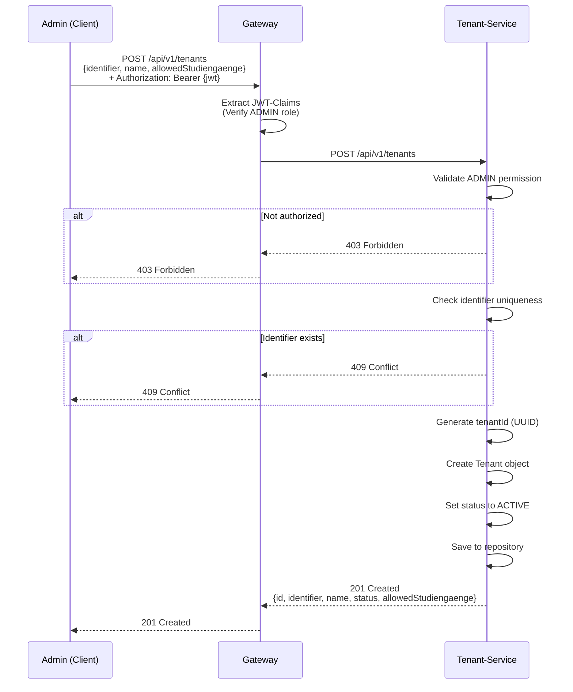
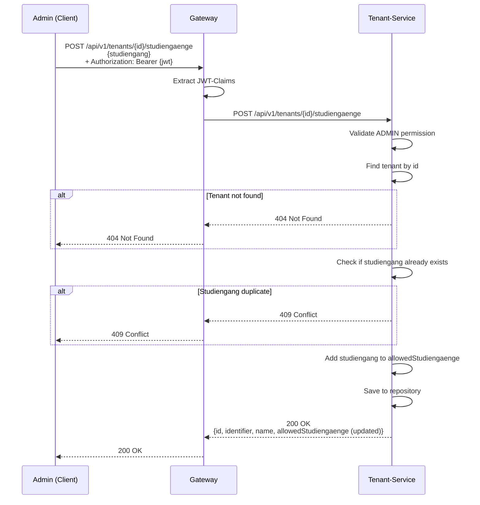
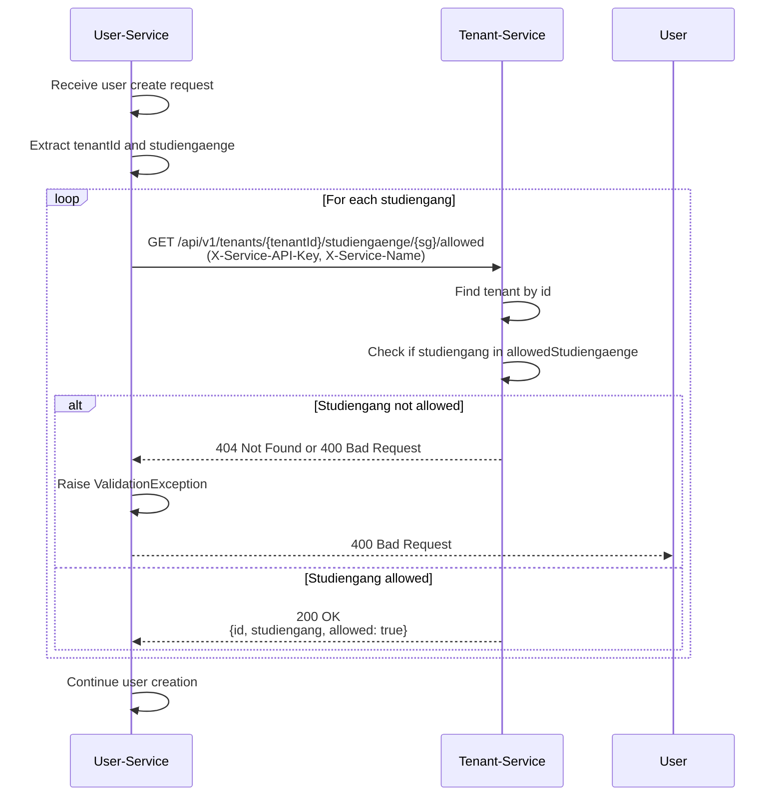
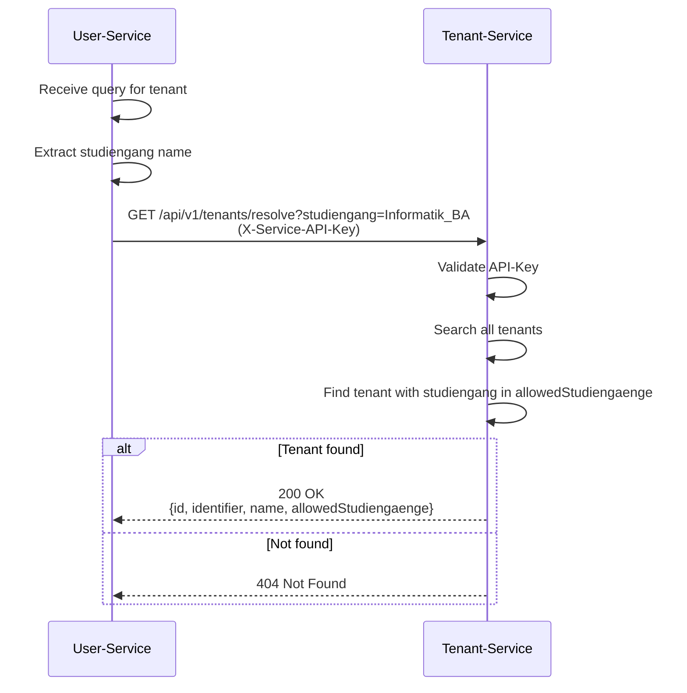

# Tenant-Service - Architektur und Schnittstellendefinition

## 1. Übersicht

### 1.1 Zweck des Services
Der Tenant-Service ist verantwortlich für:
- Verwaltung von Fachbereichen (Tenants)
- Verwaltung von erlaubten Studiengängen pro Tenant
- Validierung von Tenant-Existenz
- Validierung von Studiengang-Zuweisung
- Tenant-Aktivierung/Deaktivierung
- Lookup-Funktionen für Tenants

### 1.2 Architektur-Position
```
┌──────────────────────────────────────────────────┐
│         Gateway-Service (Port 8080)              │
│    JWT Validation & X-User-* Headers             │
└────────────────┬─────────────────────────────────┘
                 │
         Client Requests
                 │
┌────────────────▼─────────────────────────────────────────┐
│  Tenant-Service: Tenants & Studiengaenge (8084)          │
├──────────────────────────────────────────────────────────┤
│ ▼ Public Endpoints (via Gateway, ADMIN only):            │
│   - GET    /api/v1/tenants (list all)                    │
│   - GET    /api/v1/tenants/{id}                          │
│   - GET    /api/v1/tenants/by-identifier/{id}            │
│   - GET    /api/v1/tenants/{id}/identifier               │
│   - POST   /api/v1/tenants (create)                      │
│   - PUT    /api/v1/tenants/{id} (update)                 │
│   - POST   /api/v1/tenants/{id}/studiengaenge            │
│   - DELETE /api/v1/tenants/{id}/studiengaenge            │
│   - PATCH  /api/v1/tenants/{id}/activate                 │
│   - PATCH  /api/v1/tenants/{id}/deactivate               │
│   - DELETE /api/v1/tenants/{id}                          │
│                                                          │
│ ▼ Internal Endpoints (API-Key auth):                     │
│   - GET /api/v1/tenants/{id}                             │
│   - GET /api/v1/tenants/{id}/studiengaenge/{sg}/allowed  │
│   - GET /api/v1/tenants/by-identifier/{id}               │
│   - GET /api/v1/tenants/resolve?studiengang={sg}         │
└────────────┬─────────────────────────────────────────────┘
             │
      Service-to-Service Calls (X-Service-API-Key)
             │
    ┌────────▼──────────────┐
    │ User-Service          │
    │ (Port 8081)           │
    │ Calls to validate     │
    │ tenants & studiengaenge│
    └───────────────────────┘
```

### 1.3 Technologie-Stack
| Komponente | Technologie |
|------------|-------------|
| Framework | Spring Boot 3.x |
| Sprache | Java 17 |
| Security | Gateway Headers (X-User-*), API-Key |
| Datenbank | In-Memory (Map-based Repository) |
| Build-Tool | Maven |
| Container | Docker |
| Port | 8084 |

---

## 2. Funktionsbeschreibung

### 2.1 Kernfunktionen

| Funktion | Beschreibung | Eingabe | Ausgabe |
|----------|--------------|---------|---------|
| **Tenant-Erstellung** | Neuen Tenant (Fachbereich) anlegen | CreateTenantRequest | Tenant mit ID |
| **Tenant-Abruf** | Tenant nach ID oder Identifier | tenantId / identifier | Tenant-Objekt |
| **Tenant-Aktualisierung** | Tenant-Daten ändern | UpdateTenantRequest | Aktualisierter Tenant |
| **Tenant-Lookup** | Tenant nach Identifier abrufen | identifier | Tenant-Objekt |
| **Studiengang-Validierung** | Prüfung ob Studiengang erlaubt | tenantId, studiengang | Boolean |
| **Studiengang-Hinzufügen** | Neuen Studiengang erlauben | tenantId, studiengang | Updated Tenant |
| **Studiengang-Entfernen** | Studiengang de-aktivieren | tenantId, studiengang | Updated Tenant |
| **Tenant-Deaktivierung** | Tenant für inaktiv markieren | tenantId | Void |
| **Tenant-Aktivierung** | Tenant wieder aktivieren | tenantId | Void |
| **Tenant-Auflösung** | Tenant nach Studiengang finden | studiengang | Tenant-Objekt |

### 2.2 Geschäftsprozesse

#### Tenant-Erstellung
1. ADMIN sendet POST /api/v1/tenants
2. Tenant-Service validiert:
   - Identifier ist eindeutig
   - Name ist nicht leer
   - Studiengänge sind gültig (Format)
3. Tenant wird erstellt und gespeichert
4. Tenant wird mit ID zurückgegeben

#### Studiengang-Verwaltung
1. ADMIN sendet POST /api/v1/tenants/{id}/studiengaenge oder DELETE
2. Tenant-Service validiert:
   - Tenant existiert
   - Studiengang nicht bereits vorhanden (bei ADD)
   - Studiengang existiert (bei DELETE)
3. Studiengang wird hinzugefügt/entfernt
4. Updated Tenant wird zurückgegeben


---

## 3. Architektur-Komponenten

### 3.1 Schichtenmodell
```
┌─────────────────────────────────────────────────────┐
│              Presentation Layer                     │
│  ┌───────────────────────────────────────────┐      │
│  │       TenantController                    │      │
│  │  - GET /                                  │      │
│  │  - GET /{id}                              │      │
│  │  - GET /by-identifier/{identifier}        │      │
│  │  - GET /{id}/identifier                   │      │
│  │  - GET /{id}/studiengaenge/{sg}/allowed   │      │
│  │  - GET /resolve (studiengang lookup)      │      │
│  │  - POST /                                 │      │
│  │  - PUT /{id}                              │      │
│  │  - POST /{id}/studiengaenge               │      │
│  │  - DELETE /{id}/studiengaenge             │      │
│  │  - PATCH /{id}/activate                   │      │
│  │  - PATCH /{id}/deactivate                 │      │
│  │  - DELETE /{id}                           │      │
│  └───────────────────────────────────────────┘      │
└───────────────────┬─────────────────────────────────┘
                    │
┌───────────────────▼─────────────────────────────────┐
│               Business Layer                        │
│  ┌───────────────────────────────────────────┐      │
│  │       TenantService                       │      │
│  │  - createTenant(request)                  │      │
│  │  - getTenant(id)                          │      │
│  │  - getTenantByIdentifier(identifier)      │      │
│  │  - getAllTenants()                        │      │
│  │  - updateTenant(id, request)              │      │
│  │  - addStudiengang(tenantId, sg)           │      │
│  │  - removeStudiengang(tenantId, sg)        │      │
│  │  - isStudiengangAllowed(tenantId, sg)     │      │
│  │  - resolveTenantByStudiengang(sg)         │      │
│  │  - activateTenant(id)                     │      │
│  │  - deactivateTenant(id)                   │      │
│  │  - deleteTenant(id)                       │      │
│  └───────────────────────────────────────────┘      │
└───────────────────┬─────────────────────────────────┘
                    │
┌───────────────────▼─────────────────────────────────┐
│              Data Access Layer                      │
│  ┌───────────────────────────────────────────┐      │
│  │      TenantRepository                     │      │
│  │  - Map<UUID, Tenant>                      │      │
│  │  - findById(id)                           │      │
│  │  - findByIdentifier(identifier)           │      │
│  │  - findAll()                              │      │
│  │  - save(tenant)                           │      │
│  │  - delete(id)                             │      │
│  └───────────────────────────────────────────┘      │
└─────────────────────────────────────────────────────┘
```

### 3.2 Externe Abhängigkeiten
```
┌──────────────────────┐
│  Tenant-Service      │
└──────────┬───────────┘
           │
           ├──────────► User-Service
           │            - Validiert Studiengänge
           │            - Validiert Tenant-IDs
           │
           └──────────► Auth-Service
                        - (Keine direkte Abhängigkeit)
                        - Credentials speichern Tenant-IDs
```

---

## 4. Datenmodell

### 4.1 Tenant Entity
```java
public class Tenant {
    private UUID id;                           // Primärschlüssel
    private String identifier;                 // Eindeutig (z.B. FB2-DEPT)
    private String name;                       // Name des Fachbereichs
    private String description;                // Beschreibung
    private Set<String> allowedStudiengaenge;  // Erlaubte Studiengänge
    private Status status;                     // ACTIVE, INACTIVE
    private LocalDateTime createdAt;
    private LocalDateTime updatedAt;
}
```

### 4.2 Datenmodell-Diagramm
```
┌──────────────────────────────────────┐
│            Tenant                    │
├──────────────────────────────────────┤
│ - id: UUID (PK)                      │
│ - identifier: String (Unique)        │
│ - name: String                       │
│ - description: String                │
│ - allowedStudiengaenge: Set<String>  │
│ - status: Status                     │
│ - createdAt: LocalDateTime           │
│ - updatedAt: LocalDateTime           │
└──────────────────────────────────────┘
       │
       └────────────────┐
                        │
           ┌────────────▼──────────────┐
           │  User (im User-Service)   │
           │                           │
           │ - tenantIds: Set<UUID>    │
           │ - studiengaenge: Set      │
           └───────────────────────────┘
```

### 4.3 DTO Modelle

**CreateTenantRequest:**
```java
public class CreateTenantRequest {
    private String identifier;
    private String name;
    private String description;
    private Set<String> allowedStudiengaenge;
}
```

**UpdateTenantRequest:**
```java
public class UpdateTenantRequest {
    private String name;
    private String description;
    private Set<String> allowedStudiengaenge;
    private Status status;
}
```

**TenantResponse:**
```java
public class TenantResponse {
    private UUID id;
    private String identifier;
    private String name;
    private String description;
    private Set<String> allowedStudiengaenge;
    private Status status;
    private LocalDateTime createdAt;
    private LocalDateTime updatedAt;
}
```

**StudiengangRequest:**
```java
public class StudiengangRequest {
    private String studiengang;
}
```

---

## 5. Schnittstellen-Definition

### 5.1 Externe Schnittstellen (für ADMIN über Gateway)

| Methode | Endpoint | Beschreibung | Berechtigung |
|---------|----------|--------------|--------------|
| GET | `/api/v1/tenants` | Alle Tenants abrufen | ADMIN |
| GET | `/api/v1/tenants/{id}` | Tenant nach ID abrufen | ADMIN |
| GET | `/api/v1/tenants/by-identifier/{identifier}` | Tenant nach Identifier | ADMIN |
| GET | `/api/v1/tenants/{id}/identifier` | Identifier von Tenant | ADMIN |
| POST | `/api/v1/tenants` | Tenant erstellen | ADMIN |
| PUT | `/api/v1/tenants/{id}` | Tenant aktualisieren | ADMIN |
| POST | `/api/v1/tenants/{id}/studiengaenge` | Studiengang hinzufügen | ADMIN |
| DELETE | `/api/v1/tenants/{id}/studiengaenge` | Studiengang entfernen | ADMIN |
| PATCH | `/api/v1/tenants/{id}/activate` | Tenant aktivieren | ADMIN |
| PATCH | `/api/v1/tenants/{id}/deactivate` | Tenant deaktivieren | ADMIN |
| DELETE | `/api/v1/tenants/{id}` | Tenant löschen | ADMIN |

### 5.2 Interne Schnittstellen (Service-zu-Service)

| Methode | Endpoint | Beschreibung | Aufrufer |
|---------|----------|--------------|----------|
| GET | `/api/v1/tenants/{id}` | Tenant-Validierung | User-Service |
| GET | `/api/v1/tenants/{id}/studiengaenge/{sg}/allowed` | Studiengang-Validierung | User-Service |
| GET | `/api/v1/tenants/by-identifier/{identifier}` | Tenant-Lookup | User-Service |
| GET | `/api/v1/tenants/resolve?studiengang={sg}` | Tenant von Studiengang | User-Service |

---

## 6. User Stories

### US-TENANT-01: Admin erstellt Tenant (Fachbereich)
**Als** Administrator  
**möchte ich** einen neuen Fachbereich (Tenant) erstellen  
**damit** Studiengänge und User einem Fachbereich zugeordnet werden können

**Akzeptanzkriterien:**
- [x] Identifier muss eindeutig sein
- [x] Name ist erforderlich
- [x] Studiengänge können bei Erstellung definiert werden
- [x] Status wird auf ACTIVE gesetzt
- [x] 201 Created wird zurückgegeben mit Tenant-Daten

### US-TENANT-02: Admin fügt Studiengänge zu Tenant hinzu
**Als** Administrator  
**möchte ich** Studiengänge zu einem Tenant hinzufügen/entfernen  
**damit** User können die Studiengänge des Tenants zugewiesen bekommen

**Akzeptanzkriterien:**
- [x] Tenant muss existieren
- [x] Studiengang darf nicht bereits existieren (bei ADD)
- [x] Duplikate werden abgelehnt (HTTP 409)
- [x] POST: Studiengang wird hinzugefügt
- [x] DELETE: Studiengang wird entfernt
- [x] Updated Tenant wird zurückgegeben

### US-TENANT-03: User-Service validiert Studiengang
**Als** User-Service  
**möchte ich** validieren ob ein Studiengang in einem Tenant erlaubt ist  
**damit** kann ich User-Erstellung mit gültigen Studiengängen einschränken

**Akzeptanzkriterien:**
- [x] GET /api/v1/tenants/{id}/studiengaenge/{sg}/allowed
- [x] Rückgabe: true/false (200 OK)
- [x] Keine API-Key Validierung nötig für interne Calls
- [x] Schnelle Antwort (< 100ms)

### US-TENANT-04: Admin sucht Tenant nach Studiengang
**Als** Administrator  
**möchte ich** einen Tenant nach Studiengang auflösen  
**damit** ich weiß welcher Fachbereich für einen Studiengang zuständig ist

**Akzeptanzkriterien:**
- [x] GET /api/v1/tenants/resolve?studiengang={sg}
- [x] Rückgabe: Tenant-Daten oder 404 Not Found
- [x] Query-Parameter wird URL-encoded
- [x] 200 OK bei Erfolg

### US-TENANT-05: Tenant-Deaktivierung
**Als** Administrator  
**möchte ich** einen Tenant deaktivieren  
**damit** keine neuen User für inaktive Tenants erstellt werden können

**Akzeptanzkriterien:**
- [x] Status wird auf INACTIVE gesetzt
- [x] User mit inaktivem Tenant können sich nicht einloggen
- [x] PATCH /api/v1/tenants/{id}/deactivate
- [x] 204 No Content wird zurückgegeben

### US-TENANT-06: Admin listet alle Fachbereiche auf
**Als** Administrator  
**möchte ich** alle Fachbereiche (Tenants) einsehen und auflisten  
**damit** ich einen Überblick über die Mandantenstruktur habe

**Akzeptanzkriterien:**
- [x] GET /api/v1/tenants gibt alle Tenants zurück
- [x] Sowohl ACTIVE als auch INACTIVE Tenants werden angezeigt
- [x] Response enthält: id, identifier, name, allowedStudiengaenge, status
- [x] 200 OK wird zurückgegeben
- [x] Admin-Berechtigung erforderlich

### US-TENANT-07: Admin aktualisiert Fachbereich
**Als** Administrator  
**möchte ich** einen Fachbereich aktualisieren  
**damit** Name, Beschreibung und Status angepasst werden können

**Akzeptanzkriterien:**
- [x] PUT /api/v1/tenants/{id} mit aktualisierten Daten
- [x] Updatebar: name, description, allowedStudiengaenge, status
- [x] Identifier kann nicht geändert werden (read-only)
- [x] Bei ungültigem Tenant: 404 Not Found
- [x] 200 OK wird mit aktualisierten Daten zurückgegeben
- [x] Admin-Berechtigung erforderlich
- [x] Status-Change zu INACTIVE: Betroffene User können sich nicht mehr einloggen

### US-TENANT-08: Admin löscht Fachbereich dauerhaft
**Als** Administrator  
**möchte ich** einen Fachbereich permanent löschen  
**damit** nicht mehr benötigte Tenants entfernt werden können

**Akzeptanzkriterien:**
- [x] DELETE /api/v1/tenants/{id}
- [x] Tenant wird aus Repository gelöscht
- [x] Zugehörige User in diesem Tenant sind logisch noch vorhanden (kein Cascade Delete)
- [x] Neue User können nicht diesem Tenant zugeordnet werden (nicht mehr abrufbar)
- [x] 204 No Content wird zurückgegeben
- [x] 404 Not Found wenn Tenant nicht existiert
- [x] Admin-Berechtigung erforderlich

---

## 7. Sequenzdiagramme

### 7.1 Tenant-Erstellung


### 7.2 Studiengang-Hinzufügung


### 7.3 Studiengang-Validierung (von User-Service)


### 7.4 Tenant-Lookup nach Studiengang


---

## 8. Sicherheitskonzept

### 8.1 Rolle-basierte Zugriffskontrolle

| Funktion | ADMIN | PRUEFUNGSAMT | STUDENT | LEHRENDER |
|----------|-------|--------------|---------|-----------|
| Alle Tenants sehen | ✓ | ✗ | ✗ | ✗ |
| Tenant erstellen | ✓ | ✗ | ✗ | ✗ |
| Tenant aktualisieren | ✓ | ✗ | ✗ | ✗ |
| Studiengang verweben | ✓ | ✗ | ✗ | ✗ |
| Tenant aktivieren/deaktivieren | ✓ | ✗ | ✗ | ✗ |
| Tenant löschen | ✓ | ✗ | ✗ | ✗ |

### 8.2 Interne Aufrufe
- Nur `User-Service` ruft `Tenant-Service` auf
- API-Key Validierung: `X-Service-API-Key` + `X-Service-Name` erforderlich
- Header validieren vor Datenrückgabe

---

## 9. Fehlerbehandlung

| HTTP Status | Fehler | Beschreibung |
|-------------|--------|--------------|
| 400 | Bad Request | Ungültige Eingabedaten (Validierung fehlgeschlagen) |
| 401 | Unauthorized | Fehlendes/ungültiges API-Key für interne Calls |
| 403 | Forbidden | ADMIN-Berechtigung erforderlich |
| 404 | Not Found | Tenant/Studiengang nicht gefunden |
| 409 | Conflict | Identifier/Studiengang existiert bereits |
| 500 | Internal Server Error | Unerwarteter Fehler |

**Fehler-Response Format:**
```json
{
  "error": "Conflict",
  "message": "Tenant with identifier 'FB2-DEPT' already exists",
  "status": 409,
  "timestamp": "2026-02-15T12:00:00Z"
}
```

---

## 10. Validierungsregeln

### 10.1 Tenant-Erstellung
```
- identifier: nicht null, unique, pattern: [A-Z0-9]{2,5}-DEPT
- name: nicht null, min 3, max 100 Zeichen
- description: optional, max 500 Zeichen
- allowedStudiengaenge: optional, min 1 Studiengang empfohlen
```

### 10.2 Studiengang-Verwaltung
```
- studiengang: nicht null, format: Name_BA/MA/Diplom
- duplikate: werden abgelehnt (409 Conflict)
- case-sensitive: "Informatik_BA" ≠ "informatik_ba"
```

---

## 11. Deployment-Konfiguration

### 11.1 Environment Variables
```yaml
API_KEY_NAME: "tenant-service"
API_KEY_VALUE: "tenant-service-api-key"
```

### 11.2 Docker Configuration
```yaml
tenant-service:
  build: ./tenant-service
  ports:
    - "8084:8084"
  environment:
    - API_KEY_NAME=tenant-service
    - API_KEY_VALUE=tenant-service-api-key
  depends_on: []
```

---

## 12. Test-Daten

Bei Startup werden zwei Tenants initialisiert:

| Identifier | Name | Studiengänge |
|-----------|------|--------------|
| FB2-DEPT | Fachbereich 2 | Informatik_BA |
| FB3-DEPT | Fachbereich 3 | Accounting_and_Finance_MA, Luftverkehrsmanagement_-_Aviation_Management_dual_BA |

---

## 13. Testing-Strategie

### 13.1 Unit Tests
- TenantService: createTenant(), addStudiengang(), removeStudiengang()
- isStudiengangAllowed() für verschiedene Szenarien
- resolveTenantByStudiengang()

### 13.2 Integration Tests
- Tenant-Erstellung mit Studiengängen
- Duplikat-Identifier Ablehnung
- User-Service Validierung
- Studiengang-Lookup

### 13.3 Test-Szenarien
```
✓ Admin erstellt Tenant erfolgreich
✓ Duplikat-Identifier wird abgelehnt (409)
✓ Studiengang-Hinzufügung validiert
✓ Duplikat-Studiengang wird abgelehnt (409)
✓ User-Service kann Studiengang validieren
✓ User-Service kann Tenant nach Studiengang auflösen
✓ Inaktive Tenants sind im Lookup sichtbar
✓ Permissions-Check auf ADMIN
```

---

## 14. Für was wurde die KI im Projekt genutzt

- Code-Generierung: erste Implementierungen, Hilfsfunktionen, Endpunkt-Skelette
- Code-Ueberpruefung: schnelle Plausibilitaetschecks, Edge-Case Hinweise, Sicherheitschecks
- Dokumentation: Architekturtexte, Endpunktlisten, Sequenzdiagramme
- Die fachlichen Inhalte, Architekturentscheidungen und technische Spezifikation wurden eigenständig erarbeitet.


