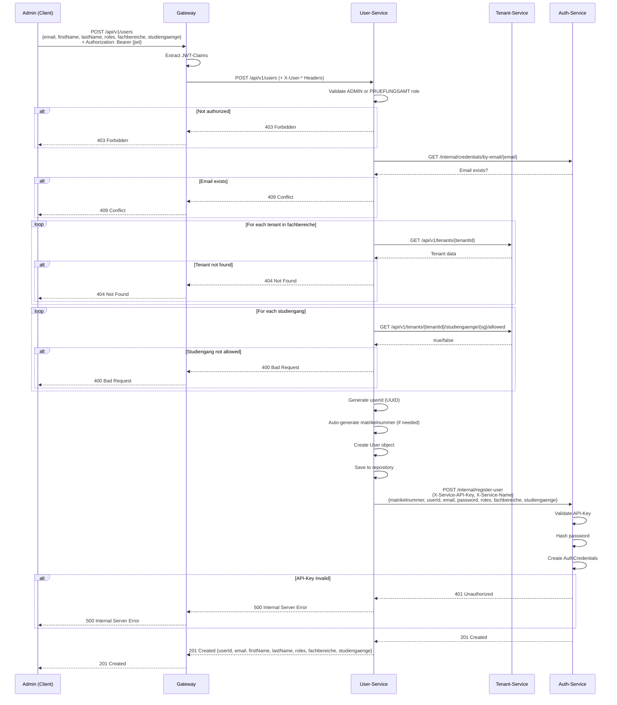
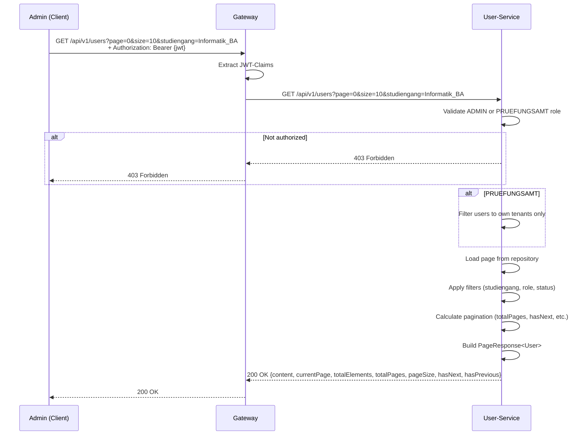
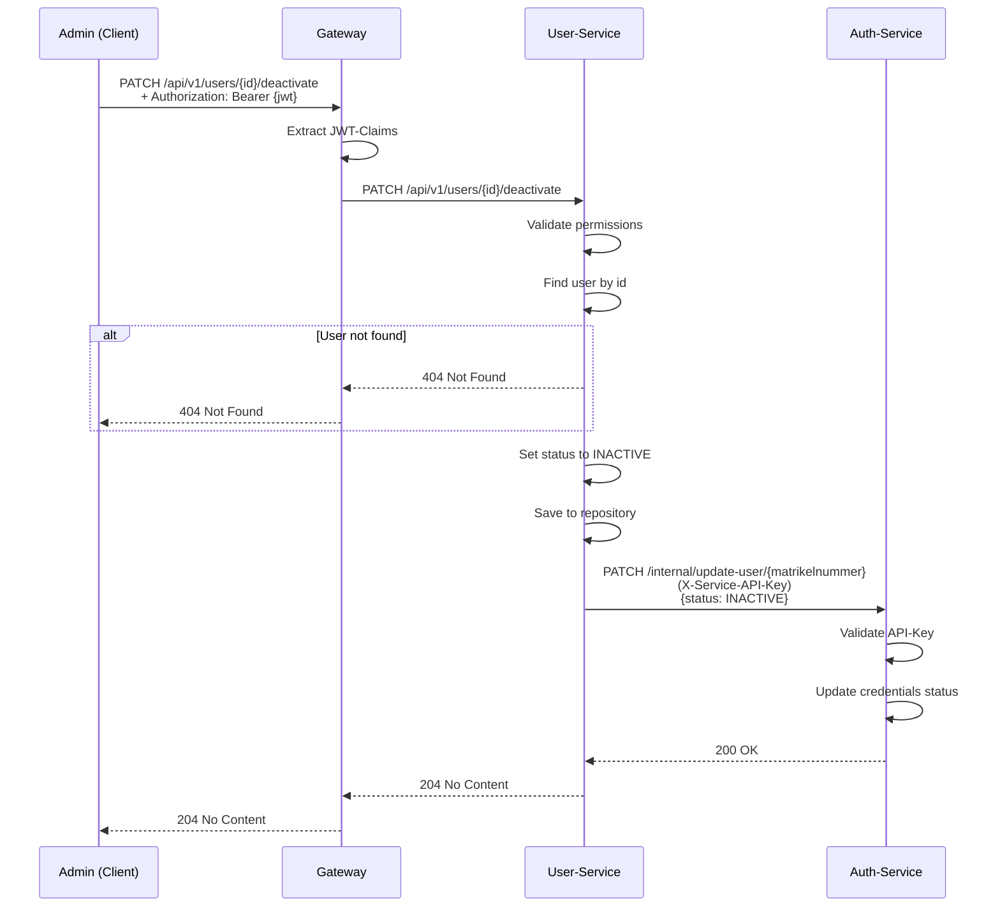
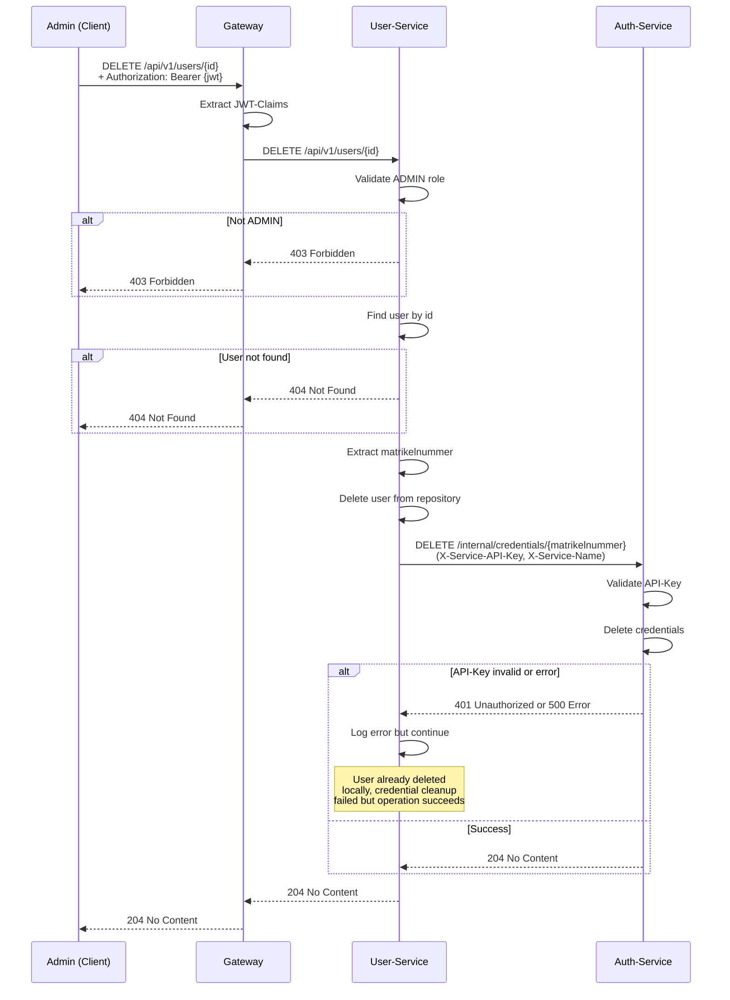
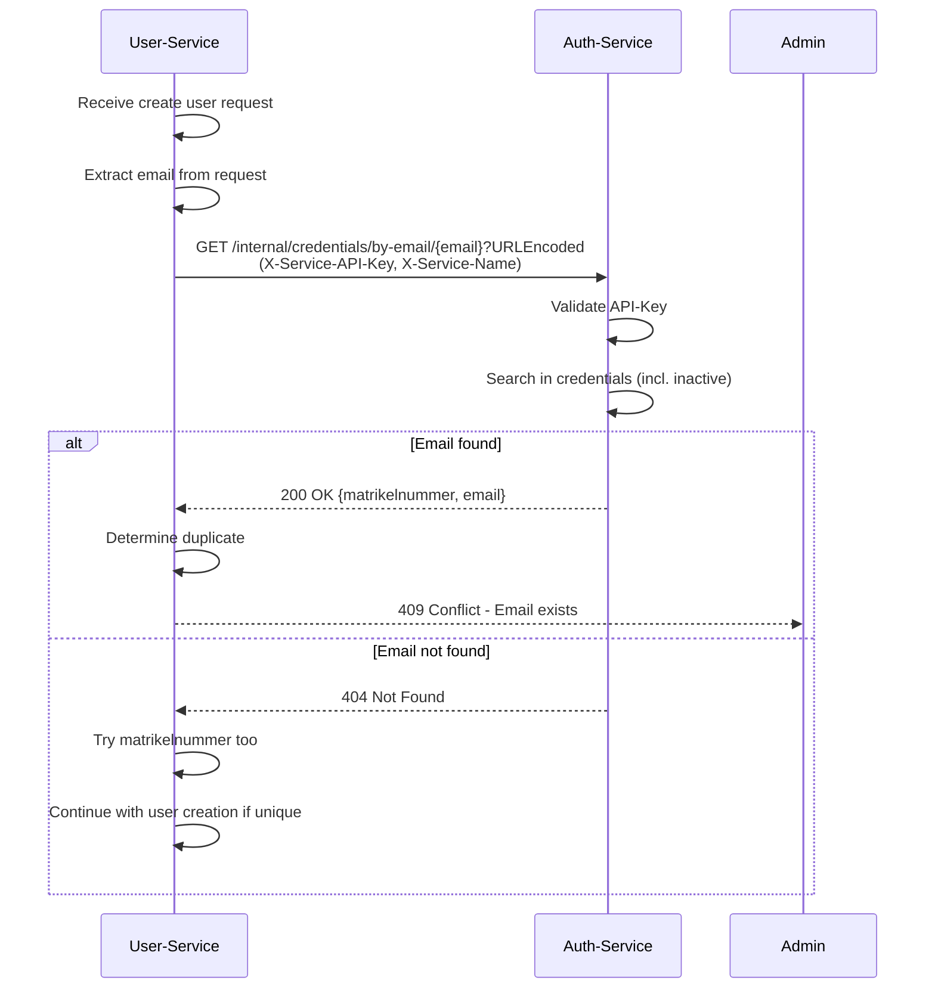

# User-Service - Architektur und Schnittstellendefinition

## 1. Übersicht

### 1.1 Zweck des Services
Der User-Service ist verantwortlich für:
- Verwaltung von User-Profil-Daten
- CRUD-Operationen für Benutzer
- Zuweisung von Rollen und Tenants zu Usern
- Verwaltung von Studiengängen pro User
- Synchronisierung mit Auth-Service
- Validierung gegen Tenant-Service
- Rollenbasierte Zugriffskontrolle 
- Multi-Tenant und Multi-Studiengang Support

### 1.2 Architektur-Position
```
┌──────────────────────────────────────────────────┐
│         Gateway-Service (Port 8080)              │
│    JWT Validation & X-User-* Headers             │
└────────────────┬─────────────────────────────────┘
                 │
         Client Requests
                 │
┌────────────────▼──────────────────────────────────────┐
│   User-Service: User Management (Port 8081)           │
├───────────────────────────────────────────────────────┤
│ ▼ Public Endpoints (via Gateway):                     │
│   - GET    /api/v1/users (paginated list)             │
│   - GET    /api/v1/users/{id}                         │
│   - POST   /api/v1/users (create)                     │
│   - PATCH  /api/v1/users/{id}                         │
│   - PATCH  /api/v1/users/{id}/credentials             │
│   - PATCH  /api/v1/users/{id}/activate                │
│   - PATCH  /api/v1/users/{id}/deactivate              │
│   - DELETE /api/v1/users/{id}                         │
│                                                       │
│ ▼ Internal Endpoints (API-Key auth):                  │
│   - GET /api/v1/users/internal/by-matrikelnummer/{mn} │
└────────────┬──────────────────────────┬───────────────┘
             │                          │
      Service-to-Service Calls (X-Service-API-Key)
             │                          │
    ┌────────▼────────┐      ┌──────────▼───────┐
    │ Auth-Service    │      │ Tenant-Service   │
    │ (Port 8085)     │      │ (Port 8084)      │
    └─────────────────┘      └──────────────────┘
```

### 1.3 Technologie-Stack
| Komponente | Technologie |
|------------|-------------|
| Framework | Spring Boot 3.x |
| Sprache | Java 17 |
| Security | Spring Security, JWT, API-Key |
| Datenbank | In-Memory (Map-based Repository) |
| Build-Tool | Maven |
| Container | Docker |
| Port | 8081 |

---


## 2. Funktionsbeschreibung

### 2.1 Kernfunktionen

| Funktion | Beschreibung | Eingabe | Ausgabe |
|----------|--------------|---------|---------|
| **User-Erstellung** | Neuen User mit Profil anlegen | CreateUserRequest | User mit ID |
| **User-Abruf (ID)** | User nach ID abrufen | userId | User-Objekt |
| **User-Abruf (List)** | Alle User abrufen (mit Filter) | page, size, filters | Page<User> |
| **User-Aktualisierung** | Profildaten ändern | UpdateUserRequest | Aktualisierter User |
| **User-Deaktivierung** | User-Status auf INACTIVE | userId | Void |
| **User-Aktivierung** | User-Status auf ACTIVE | userId | Void |
| **User-Löschung** | User permanent löschen | userId | Void |
| **Credentials-Update** | Credentials aktualisieren | UpdateCredentialsRequest | User-Objekt |

### 2.2 Geschäftsprozesse

#### User-Erstellung (ADMIN/PRUEFUNGSAMT)
1. ADMIN oder PRUEFUNGSAMT sendet POST /api/v1/users
2. User-Service validiert Permissions
3. User-Service validiert Eingabedaten:
   - Email ist eindeutig (auch inaktive User)
   - Matrikelnummer ist eindeutig
   - Tenant existiert
   - Studiengänge sind in Tenant erlaubt
4. User wird lokal erstellt
5. User-Service synchronisiert zu Auth-Service (POST /internal/register-user)
6. 201 Created mit User-Daten wird zurückgegeben

#### User-Abruf (mit Pagination & Filter)
1. ADMIN sendet GET /api/v1/users?page=0&size=10&studiengang=Informatik_BA
2. User-Service validiert Permissions
3. User-Service lädt Seite aus Repository mit Filters
4. 200 OK mit Page-Wrapper wird zurückgegeben

#### User-Aktualisierung
1. ADMIN/PRUEFUNGSAMT sendet PATCH /api/v1/users/{id}
2. User-Service validiert Permissions (auch Tenant-Isolation)
3. User wird aktualisiert lokal
4. User-Service synchronisiert zu Auth-Service (PATCH /internal/update-user)
5. 200 OK mit aktualisierten Daten wird zurückgegeben

#### User-Löschung (nur ADMIN)
1. ADMIN sendet DELETE /api/v1/users/{id}
2. User-Service validiert ADMIN permission
3. User wird aus Repository gelöscht
4. User-Service löscht Credentials in Auth-Service (DELETE /internal/credentials)
5. 204 No Content wird zurückgegeben

---

## 3. Architektur-Komponenten

### 3.1 Schichtenmodell
```
┌─────────────────────────────────────────────────────┐
│              REST Controller Layer                  │
│  ┌───────────────────────────────────────────┐      │
│  │       UserController                      │      │
│  │  - GET /                                  │      │
│  │  - GET / (paginated)                      │      │
│  │  - GET /{id}                              │      │
│  │  - POST /                                 │      │
│  │  - PATCH /{id}                            │      │
│  │  - PATCH /{id}/credentials                │      │
│  │  - PATCH /{id}/activate                   │      │
│  │  - PATCH /{id}/deactivate                 │      │
│  │  - DELETE /{id}                           │      │
│  │  - GET /internal/by-matrikelnummer/{mn}   │      │
│  └───────────────────────────────────────────┘      │
└───────────────────┬─────────────────────────────────┘
                    │
┌───────────────────▼─────────────────────────────────┐
│               Service Layer                         │
│  ┌───────────────────────────────────────────┐      │
│  │         UserService                       │      │
│  │  - createUser(request)                    │      │
│  │  - getUser(id)                            │      │
│  │  - getUserPage(page, size, filters)       │      │
│  │  - getAllUsers()                          │      │
│  │  - updateUser(id, request)                │      │
│  │  - deleteUser(id)                         │      │
│  │  - deactivateUser(id)                     │      │
│  │  - activateUser(id)                       │      │
│  │  - getUsersByTenant(tenantId)             │      │
│  │  - getUsersByStudiengang(studiengang)     │      │
│  └───────────────────────────────────────────┘      │
│  ┌───────────────────────────────────────────┐      │
│  │    ValidationService                      │      │
│  │  - validateTenant(tenantId)               │      │
│  │  - validateStudiengang(tenantId, sg)      │      │
│  │  - validateEmailUniqueness(email)         │      │
│  │  - validateMatrikelnummerUniqueness(mn)   │      │
│  └───────────────────────────────────────────┘      │
└───────────────────┬─────────────────────────────────┘
                    │
┌───────────────────▼─────────────────────────────────┐
│           Integration Layer                         │
│  ┌───────────────────────────────────────────┐      │
│  │   AuthServiceClient                       │      │
│  │  - registerUserWithRoles(request)         │      │
│  │  - updateUserWithRoles(id, request)       │      │
│  │  - deleteCredentials(matrikelnummer)      │      │
│  │  - checkEmailExists(email)                │      │
│  └───────────────────────────────────────────┘      │
│  ┌───────────────────────────────────────────┐      │
│  │   TenantServiceClient                     │      │
│  │  - validateTenant(tenantId)               │      │
│  │  - isStudiengangAllowed(tenantId, sg)     │      │
│  │  - getTenantByIdentifier(id)              │      │
│  └───────────────────────────────────────────┘      │
└───────────────────┬─────────────────────────────────┘
                    │
┌───────────────────▼─────────────────────────────────┐
│              Repository Layer                       │
│  ┌───────────────────────────────────────────┐      │
│  │       UserRepository                      │      │
│  │  - Map<UUID, User>                        │      │
│  │  - Map<String, UUID> (email index)        │      │
│  │  - Map<Long, UUID> (matrikelnummer idx)   │      │
│  │  - findById(id)                           │      │
│  │  - findAll()                              │      │
│  │  - findByEmail(email)                     │      │
│  │  - findByMatrikelnummer(matrikelnummer)   │      │
│  │  - findByTenant(tenantId)                 │      │
│  │  - findByStudiengang(studiengang)         │      │
│  │  - save(user)                             │      │
│  │  - delete(id)                             │      │
│  └───────────────────────────────────────────┘      │
└─────────────────────────────────────────────────────┘
```

### 3.2 External Service Dependencies
```
┌─────────────────┐
│  User-Service   │
│   (Port 8081)   │
└────────┬────────┘
         │
         ├──────────► Auth-Service (Port 8085)
         │            - POST /internal/register-user
         │            - PATCH /internal/update-user/{matrikelnummer}
         │            - DELETE /internal/credentials/{matrikelnummer}
         │            - GET /internal/credentials/by-email/{email}
         │
         └──────────► Tenant-Service (Port 8084)
                      - GET /api/v1/tenants/{id}
                      - GET /api/v1/tenants/{id}/studiengaenge/{sg}/allowed
                      - GET /api/v1/tenants/by-identifier/{id}
                      - GET /api/v1/tenants/resolve?studiengang={sg}
```

---

## 4. Datenmodell

### 4.1 User Entity
```java
public class User {
    private UUID id;                        // Primärschlüssel
    private Long matrikelnummer;            // Eindeutig, Auto-Generated
    private String email;                   // Eindeutig
    private String firstName;               // Vorname
    private String lastName;                // Nachname
    private Set<Role> roles;                // ADMIN, PRUEFUNGSAMT, STUDENT, LEHRENDER
    private Set<UUID> fachbereiche;         // Zugeordnete Fachbereiche (Tenants)
    private Set<String> studiengaenge;      // Eingeschriebene Studiengänge
    private Status status;                  // ACTIVE, INACTIVE, PENDING, SUSPENDED
    private LocalDateTime createdAt;
    private LocalDateTime updatedAt;
}
```

### 4.2 Datenmodell-Beziehungen
```
┌──────────────────────────────────────┐
│              User                    │
├──────────────────────────────────────┤
│ - id: UUID (PK)                      │
│ - matrikelnummer: Long (Unique)      │
│ - email: String (Unique)             │
│ - firstName: String                  │
│ - lastName: String                   │
│ - roles: Set<Role>                   │
│ - fachbereiche: Set<UUID>            │
│ - studiengaenge: Set<String>         │
│ - status: Status                     │
└──────────────────────────────────────┘
         │           │
         │ (Sync)    │ (Validate)
         ▼           ▼
    ┌────────┐  ┌────────┐
    │ Auth   │  │ Tenant │
    │ Creds  │  │ Service│
    └────────┘  └────────┘
```

### 4.3 DTO Modelle

**CreateUserRequest:**
```java
public class CreateUserRequest {
    private Long matrikelnummer;           // optional (auto-generated)
    private String email;
    private String password;
    private String firstName;
    private String lastName;
    private Set<Role> roles;
    private Set<UUID> fachbereiche;
    private Set<String> studiengaenge;
    private Status status;                 // default: ACTIVE
}
```

**UpdateUserRequest:**
```java
public class UpdateUserRequest {
    private String firstName;
    private String lastName;
    private Set<Role> roles;
    private Set<UUID> fachbereiche;
    private Set<String> studiengaenge;
    private Status status;
}
```

**UserResponse:**
```java
public class UserResponse {
    private UUID id;
    private Long matrikelnummer;
    private String email;
    private String firstName;
    private String lastName;
    private Set<Role> roles;
    private Set<UUID> fachbereiche;
    private Set<String> studiengaenge;
    private Status status;
    private LocalDateTime createdAt;
    private LocalDateTime updatedAt;
}
```

**PageResponse<T>:**
```java
public class PageResponse<T> {
    private List<T> content;
    private int currentPage;
    private long totalElements;
    private int totalPages;
    private int pageSize;
    private boolean hasNext;
    private boolean hasPrevious;
}
```

---

## 5. Schnittstellen-Definition


### 5.1 Externe Schnittstellen (für Clients via Gateway)

| Methode | Endpoint | Beschreibung | Berechtigung | Query-Params |
|---------|----------|--------------|--------------|--------------|
| GET | `/api/v1/users` | Alle User abrufen | ADMIN, PRUEFUNGSAMT | page, size, role, studiengang, status |
| GET | `/api/v1/users/{id}` | User nach ID | ADMIN, PRUEFUNGSAMT (eigener Tenant), Owner | - |
| POST | `/api/v1/users` | User erstellen | ADMIN, PRUEFUNGSAMT | - |
| PATCH | `/api/v1/users/{id}` | User aktualisieren | ADMIN, PRUEFUNGSAMT (eigener Tenant) | - |
| PATCH | `/api/v1/users/{id}/credentials` | Credentials aktualisieren | ADMIN, PRUEFUNGSAMT (eigener Tenant) | - |
| PATCH | `/api/v1/users/{id}/activate` | User aktivieren | ADMIN, PRUEFUNGSAMT (eigener Tenant) | - |
| PATCH | `/api/v1/users/{id}/deactivate` | User deaktivieren | ADMIN, PRUEFUNGSAMT (eigener Tenant) | - |
| DELETE | `/api/v1/users/{id}` | User löschen | ADMIN (only) | - |

### 5.2 Interne Schnittstellen (Service-zu-Service)

| Methode | Endpoint | Beschreibung | Aufrufer | Auth |
|---------|----------|--------------|----------|------|
| GET | `/api/v1/users/internal/by-matrikelnummer/{mn}` | Abruf nach Matrikelnummer | Auth-Service | API-Key |

### 5.3 Query-Parameter (für GET /api/v1/users)

| Parameter | Typ | Beschreibung | Beispiel |
|-----------|-----|--------------|----------|
| `page` | int | Seitennummer (0-basiert) | `0` |
| `size` | int | Elemente pro Seite (max 100) | `10` |
| `studiengang` | string | Filter nach Studiengang | `Informatik_BA` |
| `role` | string | Filter nach Rolle | `STUDENT` |
| `status` | string | Filter nach Status | `ACTIVE` |

---

## 6. User Stories

### US-USER-01: Admin erstellt neuen User
**Als** Administrator  
**möchte ich** einen neuen User anlegen mit allen Profildaten  
**damit** der User sich anmelden kann

**Akzeptanzkriterien:**
- [x] Email muss eindeutig sein (auch bei inaktiven Usern)
- [x] Matrikelnummer wird auto-generiert oder manuell gesetzt
- [x] Tenant muss existieren
- [x] Studiengänge müssen im Tenant erlaubt sein
- [x] Password wird sicher zu Auth-Service weitergeleitet
- [x] User wird synchron in Auth-Service gespeichert
- [x] 201 Created wird zurückgegeben

### US-USER-02: PRUEFUNGSAMT erstellt User im eigenen Tenant
**Als** Prüfungsamt-Mitarbeiter  
**möchte ich** einen neuen Student im eigenen Fachbereich erstellen  
**damit** dieser Zugriff auf die Modulverwaltung hat

**Akzeptanzkriterien:**
- [x] PRUEFUNGSAMT kann nur User im eigenen Tenant erstellen
- [x] PRUEFUNGSAMT kann keine ADMIN/PRUEFUNGSAMT Rollen zuweisen
- [x] fachbereiche werden auto-gesetzt auf eigene Tenants
- [x] User bekommt Status ACTIVE
- [x] Email-Validierung auch über inaktive User
- [x] 201 Created wird zurückgegeben
- [x] PRUEFUNGSAMT kann nur User sehen/bearbeiten/erstellen von eigenem Tenant
- [x] 403 Forbidden wenn User-Erstellung außerhalb eigener Tenants versucht

### US-USER-03: Student ruft eigenes Profil ab
**Als** Student  
**möchte ich** mein Profil abrufen  
**damit** ich meine Daten sehen kann

**Akzeptanzkriterien:**
- [x] GET /api/v1/users/{id} gibt eigenes Profil zurück (Owner)
- [x] Keine Admin-Berechtigung erforderlich
- [x] Name, Email, Rollen, Studiengänge werden zurückgegeben
- [x] 200 OK wird zurückgegeben

### US-USER-04: User wird deaktiviert
**Als** Administrator  
**möchte ich** einen User deaktivieren (z.B. bei Ausschreibung)  
**damit** dieser sich nicht mehr anmelden kann

**Akzeptanzkriterien:**
- [x] Status wird auf INACTIVE gesetzt
- [x] PATCH /api/v1/users/{id}/deactivate
- [x] Benutzer kann sich nicht mehr anmelden (Login schlägt fehl)
- [x] Email kann nicht erneut registriert werden
- [x] 204 No Content oder 200 OK wird zurückgegeben

### US-USER-05: Admin durchsucht User mit Filtern
**Als** Administrator  
**möchte ich** User nach Studiengang/Rolle/Status filtern und seitenweise abrufen  
**damit** ich große Benutzermengen verwalten kann

**Akzeptanzkriterien:**
- [x] GET /api/v1/users?page=0&size=10&studiengang=Informatik_BA
- [x] Pagination wird unterstützt
- [x] Filter sind optional und kombinierbar
- [x] Page-Wrapper wird zurückgegeben mit currentPage, totalPages, etc.
- [x] 200 OK mit gefilterten Ergebnissen

### US-USER-06: Admin löscht User permanent
**Als** Administrator  
**möchte ich** einen User permanent löschen  
**damit** System-Integrität gewährleistet ist und keine verwaisten Credentials bleiben

**Akzeptanzkriterien:**
- [x] DELETE /api/v1/users/{id}
- [x] Nur ADMIN-Berechtigung
- [x] User wird aus User-Service Repository gelöscht
- [x] Credentials werden im Auth-Service gelöscht (DELETE /internal/credentials)
- [x] 204 No Content wird zurückgegeben
- [x] Bei Fehler wird Rollback durchgeführt (wenn möglich)
- [x] Fehler beim Auth-Service Aufruf wird geloggt aber User trotzdem gelöscht

### US-USER-07: PRUEFUNGSAMT aktiviert User im eigenen Fachbereich
**Als** Prüfungsamt-Mitarbeiter  
**möchte ich** einen deaktivierten User im eigenen Fachbereich wieder aktivieren  
**damit** dieser wieder Zugriff auf die Plattform erhält

**Akzeptanzkriterien:**
- [x] PATCH /api/v1/users/{id}/activate (mit authentifiziertem User)
- [x] Nur für User im eigenen Tenant möglich
- [x] ADMIN hat Zugriff auf alle User
- [x] Status wird auf ACTIVE gesetzt
- [x] Credentials werden im Auth-Service aktualisiert
- [x] 200 OK oder 204 No Content wird zurückgegeben
- [x] 403 Forbidden bei Tenant-Isolation-Verletzung
- [x] PRUEFUNGSAMT kann nur User sehen/bearbeiten von eigenem Tenant

### US-USER-08: PRUEFUNGSAMT erstellt Lehrende und ordnet Module zu
**Als** Prüfungsamt-Mitarbeiter  
**möchte ich** Lehrende im Fachbereich anlegen und ihnen Module zuordnen  
**damit** diese ihre Noten erfassen können

**Akzeptanzkriterien:**
- [x] POST /api/v1/users mit Role=LEHRENDER
- [x] PRUEFUNGSAMT kann Lehrende nur im eigenen Fachbereich erstellen
- [x] Lehrende bekommen automatisch den Tenant des PRUEFUNGSAMT
- [x] Lehrende können Module-Zuordnung später erhalten (via noten-modulverwaltung-service)
- [x] 201 Created wird zurückgegeben
- [x] Email muss eindeutig sein
- [x] Credentials werden im Auth-Service gespeichert
- [x] PRUEFUNGSAMT kann nur Lehrende im eigenen Tenant erstellen

### US-USER-09: PRUEFUNGSAMT aktualisiert Nutzerdaten
**Als** Prüfungsamt-Mitarbeiter  
**möchte ich** Nutzerdaten von Studierenden und Lehrenden bearbeiten  
**damit** Stammdaten aktuell und korrekt bleiben

**Akzeptanzkriterien:**
- [x] PATCH /api/v1/users/{id} mit Änderungen (firstName, lastName, etc.)
- [x] PRUEFUNGSAMT kann nur User im eigenen Fachbereich aktualisieren
- [x] Email kann nicht geändert werden (read-only)
- [x] Matrikelnummer kann nicht geändert werden (read-only)
- [x] Role kann von PRUEFUNGSAMT nicht geändert werden (read-only für diese Rolle)
- [x] Änderungen werden zu Auth-Service synchronisiert
- [x] 200 OK wird zurückgegeben
- [x] 403 Forbidden bei Tenant-Isolation-Verletzung
- [x] PRUEFUNGSAMT kann nur User bearbeiten von eigenem Tenant

### US-USER-10: Admin erstellt Prüfungsamtsnutzer
**Als** Administrator  
**möchte ich** neue Prüfungsamtsnutzer erstellen  
**damit** der Zugriff auf diese sensible Rolle kontrolliert bleibt

**Akzeptanzkriterien:**
- [x] POST /api/v1/users mit Role=PRUEFUNGSAMT und tenantIds
- [x] Nur ADMIN kann PRUEFUNGSAMT-Nutzer erstellen
- [x] Ein PRUEFUNGSAMT kann einem oder mehreren Tenants zugeordnet sein
- [x] Email muss eindeutig sein
- [x] Credentials werden im Auth-Service mit vollem Zugriff gespeichert
- [x] 201 Created wird zurückgegeben
- [x] Admin sieht alle User unabhängig von Tenant

---

## 7. Sequenzdiagramme

### 7.1 User-Erstellung durch Admin


### 7.2 User-Listenabruf mit Paging & Filter


### 7.3 User-Deaktivierung


### 7.4 User-Löschung mit Credential-Cleanup


### 7.5 Email-Duplikat Validierung


---

## 8. Autorisierungskonzept

### 8.1 Rolle-basierte Zugriffskontrolle (RBAC)

| Funktion | ADMIN | PRUEFUNGSAMT | LEHRENDER | STUDENT |
|----------|-------|--------------|-----------|---------|
| Alle User sehen | ✓ | ✗ | ✗ | ✗ |
| User im eigenen Tenant | ✓ | ✓ | ✗ | ✗ |
| Eigenes Profil (/api/v1/users/{id}) | ✓ | ✓ | ✓ | ✓ |
| Einzelnes Profil ({id}) (Owner/Tenant) | ✓ | ✓ (Tenant) | ✗ | ✓ (Owner) |
| User erstellen | ✓ | ✓ (nur Tenant) | ✗ | ✗ |
| User aktualisieren | ✓ | ✓ (nur Tenant) | ✗ | ✗ |
| User-Status Change | ✓ | ✓ (nur Tenant) | ✗ | ✗ |
| User löschen | ✓ | ✗ | ✗ | ✗ |
| ADMIN/PRUEFUNGSAMT zuweisen | ✓ | ✗ | ✗ | ✗ |
| LEHRENDER/STUDENT zuweisen | ✓ | ✓ | ✗ | ✗ |

### 8.2 Tenant-Isolation
- **ADMIN:** Kein Tenant erforderlich, sieht alle User
- **PRUEFUNGSAMT:** Gebunden an ein oder mehrere Tenants, sieht nur User in eigenen Tenants
- **LEHRENDER/STUDENT:** Gebunden an Tenants, sieht nur eigene Daten
- User-Erstellung durch PRUEFUNGSAMT → Automatic Tenant-Assignment

---

## 9. Fehlerbehandlung

| HTTP Status | Fehler | Beschreibung |
|-------------|--------|--------------|
| 400 | Bad Request | Ungültige Eingabedaten (Validierung fehlgeschlagen) |
| 401 | Unauthorized | Fehlendes/ungültiges JWT-Token |
| 403 | Forbidden | Insufficient permissions |
| 404 | Not Found | User/Tenant nicht gefunden |
| 409 | Conflict | Email/Matrikelnummer existiert bereits |
| 500 | Internal Server Error | Fehler beim Sync mit Auth-Service oder Tenant-Validierung |

**Fehler-Response Format:**
```json
{
  "error": "Conflict",
  "message": "User with email 'max@example.com' already exists",
  "status": 409,
  "timestamp": "2026-02-15T12:00:00Z"
}
```

---

## 10. Validierungsregeln

### 10.1 User-Erstellung
```
- email: nicht null, valid format, unique (incl. inactive)
- firstName: nicht null, min 1, max 100 characters
- lastName: nicht null, min 1, max 100 characters
- password: nicht null, min 8 character
- matrikelnummer: optional (auto-generated if null)
- roles: min 1 role required
- fachbereiche: min 1 tenant (auto-set for PRUEFUNGSAMT)
- studiengaenge: optional, must be allowed in tenant
- status: default ACTIVE
```

### 10.2 User-Aktualisierung
```
- firstName: max 100 characters
- lastName: max 100 characters
- roles: min 1 role (PRUEFUNGSAMT kann keine ADMIN/PRUEFUNGSAMT zuweisen)
- fachbereiche: cannot be modified by PRUEFUNGSAMT (read-only)
- studiengaenge: must be allowed in tenant
- status: must be valid Status enum
- email: read-only after creation
- matrikelnummer: read-only
```

### 10.3 Paging & Filter
```
- page: >= 0, default 0
- size: 1-100, default 10
- studiengang: optional string, case-sensitive
- role: optional, must be valid Role enum
- status: optional, must be valid Status enum
```

---

## 11. Deployment-Konfiguration

### 11.1 Environment Variables
```yaml
API_KEY_NAME: "user-service"
API_KEY_VALUE: "user-service-api-key"
AUTH_SERVICE_URL: "http://auth-service:8085"
TENANT_SERVICE_URL: "http://tenant-service:8084"
```

### 11.2 Docker Configuration
```yaml
user-service:
  build: ./user-service
  ports:
    - "8080:8080"
  environment:
    - API_KEY_NAME=user-service
    - API_KEY_VALUE=${USER_SERVICE_API_KEY}
    - AUTH_SERVICE_URL=http://auth-service:8085
    - TENANT_SERVICE_URL=http://tenant-service:8084
  depends_on:
    - auth-service
    - tenant-service
  networks:
    - backend
```

---

## 12. Test-Daten

Bei Startup werden Test-User initialisiert:

| Email | Rollen | Tenant | Studiengänge | Status |
|-------|--------|--------|--------------|--------|
| admin@university.de | ADMIN | - | - | ACTIVE |
| pruefungsamt@university.de | PRUEFUNGSAMT | FB3-DEPT | - | ACTIVE |
| student@university.de | STUDENT | FB3-DEPT | Accounting_and_Finance_MA | ACTIVE |
| lehrender@university.de | LEHRENDER | FB3-DEPT | - | ACTIVE |
| informatiker@university.de | STUDENT | FB2-DEPT | Informatik_BA | ACTIVE |
| multi.student@university.de | STUDENT | FB2-DEPT, FB3-DEPT | Informatik_BA, Accounting_and_Finance_MA | ACTIVE |
| inactive@university.de | STUDENT | FB3-DEPT | Accounting_and_Finance_MA | INACTIVE |

---

## 13. Testing-Strategie

### 13.1 Unit Tests
- UserService: createUser(), updateUser(), deleteUser()
- ValidationService: Email unique, Tenant exists
- Permission checks pro Rolle
- Paging & filtering logic

### 13.2 Integration Tests
- User-Erstellung mit Auth-Sync
- User-Update mit Fehlerbehandlung
- PRUEFUNGSAMT Tenant-Isolation
- Email-Duplikat Prävention
- Tenant & Studiengang-Validierung

### 13.3 Test-Szenarien
```
✓ Admin erstellt User erfolgreich
✓ PRUEFUNGSAMT kann nur im eigenen Tenant erstellen
✓ Student kann kein User erstellen
✓ Email-Duplikat wird abgelehnt (incl. inaktiv)
✓ Ungültiger Studiengang wird abgelehnt
✓ Ungültiger Tenant wird abgelehnt
✓ User wird in Auth-Service synchronisiert
✓ Löschung synced zu Auth-Service
✓ Update synced zu Auth-Service
✓ Paging mit Filter funktioniert
✓ PRUEFUNGSAMT sieht nur eigene Tenants
✓ GET /api/v1/users/{id} gibt eigenes Profil
```
---
## 14. FÜr was wurde die KI im Projekt genutzt

- Code-Generierung: erste Implementierungen, Hilfsfunktionen, Endpunkt-Skelette
- Code-Ueberpruefung: schnelle Plausibilitaetschecks, Edge-Case Hinweise, Sicherheitschecks
- Dokumentation: Architekturtexte, Endpunktlisten, Sequenzdiagramme
- Die fachlichen Inhalte, Architekturentscheidungen und technische Spezifikation wurden eigenständig erarbeitet.

